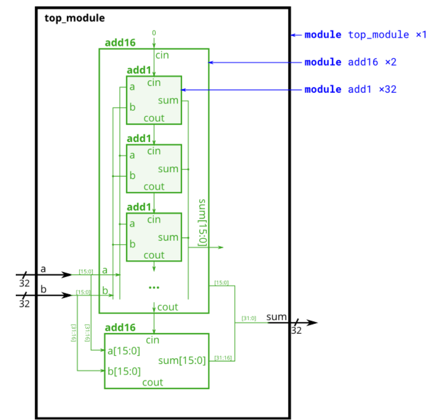

## 📌 Introduction

<!--  -->


## 🧑‍💻 Code Example
```verilog
module top_module (
    input [31:0] a,
    input [31:0] b,
    output [31:0] sum
);
	wire carry_1, dummy_wire;
    add16 add_1(.a(a[15:0]), .b(b[15:0]), .cin(1'b0), .sum(sum[15:0]), .cout(carry_1));
    add16 add_2(.a(a[31:16]), .b(b[31:16]), .cin(carry_1), .sum(sum[31:16]), .cout(dummy_wire));
endmodule

module add1 ( input a, input b, input cin,   output sum, output cout );
    assign sum  = a ^ b ^ cin;
    assign cout = (a | b) & (b | cin) & (a | cin);
endmodule
```
> Note: Don't give ```1'b0``` constant for cout, that is not correct logic.

## 📚 Reference
* [HDLBits Problem - Module add](https://hdlbits.01xz.net/wiki/Module_add)
* [HDLBits Problem - Module fadd](https://hdlbits.01xz.net/wiki/Module_fadd)
