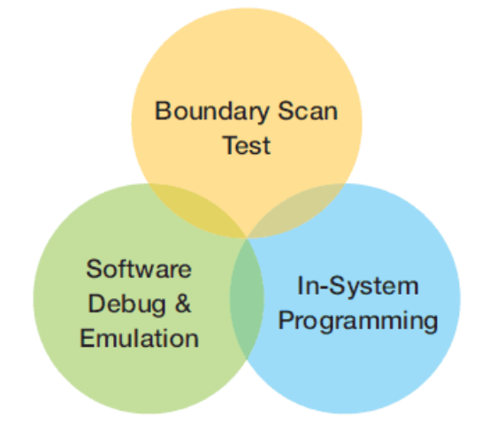
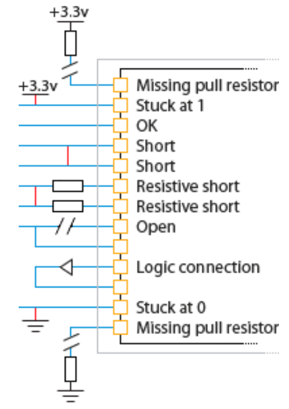

## 📌 Joint Test Action Group (JTAG)

### 歷史背景
為了測試焊到PCB上的各個元件是否連接以及其功能，會使用針床治具(bed-of-nails fixture)，進行在線測試 (ICT)。
但隨著BGA封裝、元件小型化以及表面黏著技術 (SMT)等，如何使用少量腳位連接測試連接與功能變得必要。

### 版本
* **1990 年 (第一版)：** `IEEE Std 1149.1-1990` 正式誕生，定義了 TAP Controller 和邊界掃描(Boundary Scan)架構。
* **1993/1994 年 (增補)：** 陸續推出 1149.1a 與 1149.1b，加入了 **BSDL (Boundary Scan Description Language)** 語言規範。
* **2001 年 (大整合)：** 這是一次**大整合**。它將先前的增補內容與修正案併入，成為一份完整的標準文檔。
* **2013 年 (最新重大修訂)：** 引入了更複雜的 `PDL (Procedural Description Language)` 以及對層次化設計的支持。

### JTAG 功能

<!--  -->

除了一般使用者會用到的在板燒錄 (In-System Programming)。
JTAG透過基於4線通訊架構，可做到Debug IC core與測試周邊連接的元件等等功能。

### JTAG 組成

<!--  -->

JTAG架構的核心是Test Access Port (TAP) Controller，其由16個state組成，而外部則由下面定義的介面，進行控制與輸入輸出。

* **TCK** (Test Clock): 外部送入的Clock訊號，提供給Test Mode。
* **TMS** (Test Mode Select): TCK上升沿觸發，決定TAP Controller下一個State。
* **TDI** (Test Data In): 將資料序列地shift送入，由TCK上升沿觸發，移動過程不會直接執行運行，送入資料提供後續測試或者燒錄。
* **TDO** (Test Data Out): 將反應的資料Shift out，由TCK下降沿觸發。
* Optional -  **TRST** (Test Reset): 非必要連接，可reset TAP Controller狀態。

圍繞有JTAG支持的IC與引腳之間，由許多boundary scan cells串連成的Boundary Scan Register (BSR)。
在一般執行模式下，它們是不起作用的。而在Test mode下，這些基本單元執行著Capture/Shift/Update等功能。

### JTAG Boundary Test

<!--  -->

得益於Boundary Scan，我們可僅透過四線，即可測試周邊連接。
由於JTAG測試不仰賴IC core其功能邏輯，不需等待內部韌體就緒即可開始測試。
並且透過Boundary Scan Description Language (BSDL)檔案，在開發測試階段寫的測試pattern，可以直接移植到生產時ATE (Automatic Test Equipment) 機台用的測試pattern。

## 📚 Reference
<!-- * [JTAG_IEEE-Std-1149.1-2001](/assets/day17/JTAG_IEEE-Std-1149.1-2001.pdf) -->
* IEEE Standard Test Access Port and Boundary-Scan Architecture, IEEE Std 1149.1-2001.
* [XJTAG - What is JTAG and how can I make use of it?](https://www.xjtag.com/about-jtag/what-is-jtag/?v=255a5cac7685)
* [XJTAG - Technical Guide to JTAG](https://www.xjtag.com/about-jtag/jtag-a-technical-overview/?v=255a5cac7685)
