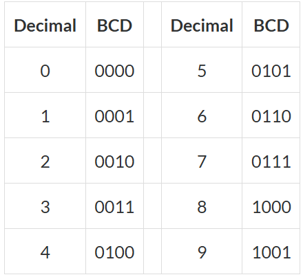
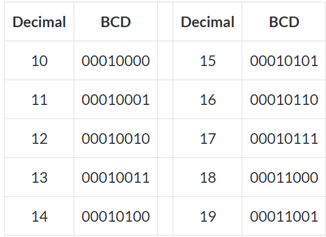
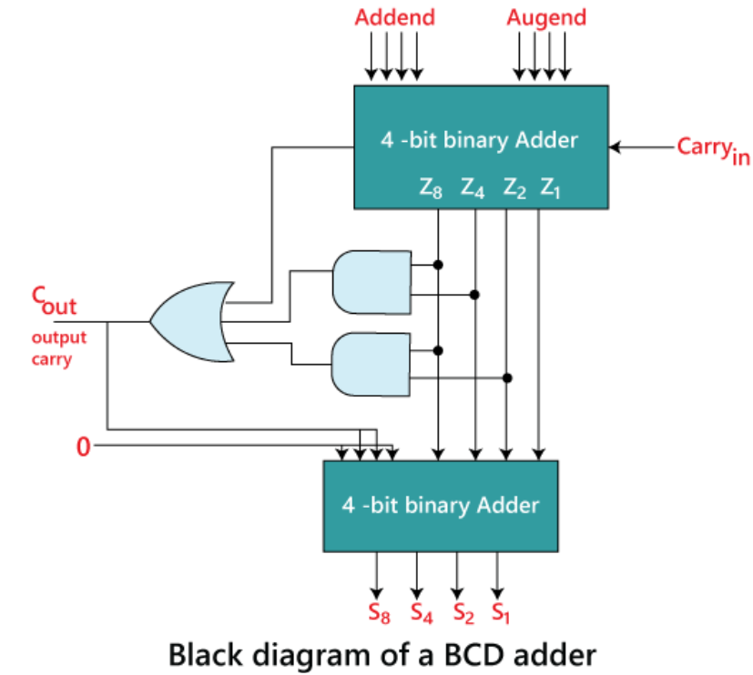

## 📌 Introduction

<!--   -->


<!--  -->

> Four bits represent one BCD digit (0–9). When a digit overflows, the carry ripples into the next 4-bit BCD digit.

<!--  -->


## 🧑‍💻 Code Example

### 100-bit binary ripple-carry adder
```verilog
module full_adder(input a, input b, input cin, output cout, output sum);
    assign sum = a ^ b ^ cin;
    assign cout = (a | b) & (b | cin) & (a | cin);
endmodule

module top_module( 
    input [99:0] a, b,
    input cin,
    output [99:0] cout,
    output [99:0] sum );
    
    genvar i;
    wire temp_cin;
    generate
        for (i=0;i<100;i++) begin: Adder100i
            full_adder adder(.a(a[i]), .b(b[i]), .cin((i==0)?cin:cout[i-1]), .cout(cout[i]), .sum(sum[i]));
        end
    endgenerate
endmodule
```
> Note: ```assign cout = (a | b) & (b | cin);``` is wrong, when b=1 the cout is always 1;

### 100-digit BCD ripple-carry adder
```verilog
module top_module( 
    input [399:0] a, b,
    input cin,
    output cout,
    output [399:0] sum );
	
    genvar i;
    wire [100:0] c;
    assign c[0] = cin;
    generate 
        for (i=0;i<100;i++) begin: Bcdadd100
            bcd_fadd adder(.a(a[4*(i+1)-1:4*i]), .b(b[4*(i+1)-1:4*i]), .cin(c[i]), .cout(c[i+1]), .sum(sum[4*(i+1)-1:4*i]));
        end
    endgenerate
    assign cout = c[100];
endmodule
```
> ```[4*(i+1)-1:4*i] -> [4*i +: 4]```


## 📚 Reference
* [HDLBits Problem - Adder100i](https://hdlbits.01xz.net/wiki/Adder100i)
* [HDLBits Problem - Bcdadd100](https://hdlbits.01xz.net/wiki/Bcdadd100)
