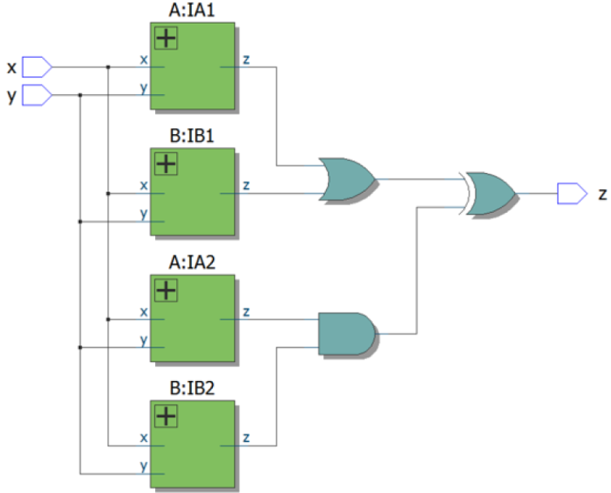

## 📌 Introduction
<!--  -->


## 🧑‍💻 Code Example

```verilog
module circuit_A(input x, input y, output z);
    assign z = (x ^ y) & x;
endmodule

module circuit_B(input x, input y, output z);
    assign z = ~(x ^ y);
endmodule

module top_module (input x, input y, output z);
    wire z_A1, z_B1, z_A2, z_B2;
    circuit_A A1(.x(x), .y(y), .z(z_A1));
    circuit_B B1(.x(x), .y(y), .z(z_B1));
    circuit_A A2(.x(x), .y(y), .z(z_A2));
    circuit_B B2(.x(x), .y(y), .z(z_B2));
    assign z = (z_A1 | z_B1) ^ (z_A2 & z_B2);
endmodule
```

## 📚 Reference
* [HDLBits Problem - Mt2015_q4](https://hdlbits.01xz.net/wiki/Mt2015_q4)
