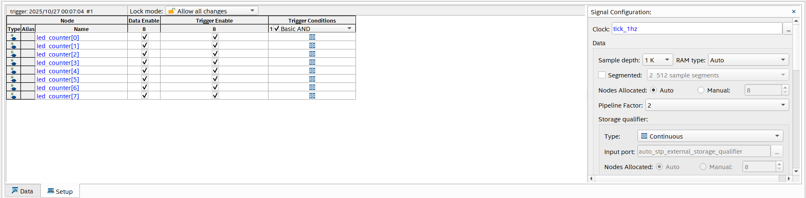
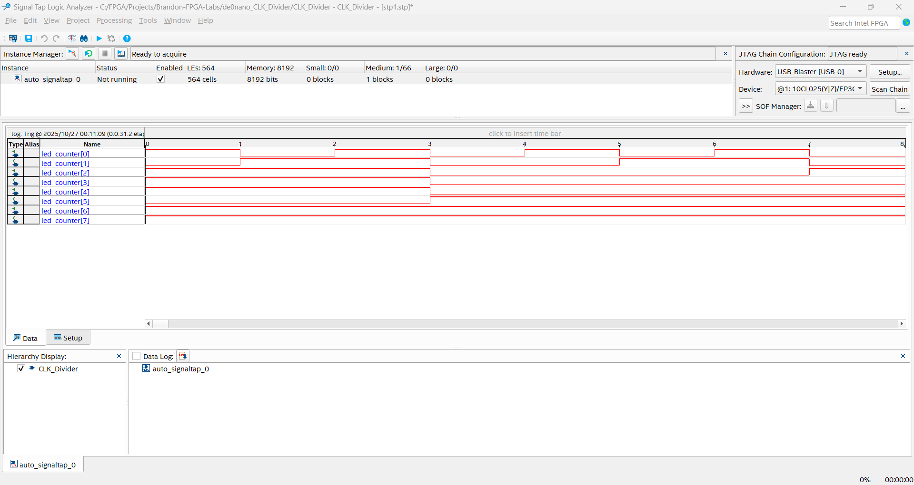

## 📌 Introduction
* Device: Intel/Altera Cyclone IV (EP4CE22F17C6, 22K LEs)
* Board: Terasic DE0-Nano
* IDE: Quartus Prime Lite Edition 21.1

## JTAG SCAN

```bash
jtagconfig

> 1) USB-Blaster [USB-0]
> 020F30DD   10CL025(Y|Z)/EP3C25/EP4CE22
```
USB driver OK
JTAG chain OK
020F30DD: IDCODE
> JTAG (IEEE 1149.1) make all compatible IC have a 32-bit IDCODE register.
> 
> To identify: Manufacturer, Device Part Number, Version.
> 
> EP4CE22: Cyclone IV E
> EP3C25: Cyclone III
> 10CL025(Y|Z): Cyclone 10 LP


## SignalTap
**SignalTap** is an on-chip logic analyzer in Intel Quartus that lets you capture and view internal FPGA signals in real time through JTAG, without external probes. Unlike **ModelSim**, which shows simulated waveforms before hardware runs, SignalTap reveals the *actual* behavior inside the FPGA after configuration — perfect for debugging real hardware issues that simulation might miss.

### Setup
<!--  -->


### Data
<!--  -->

