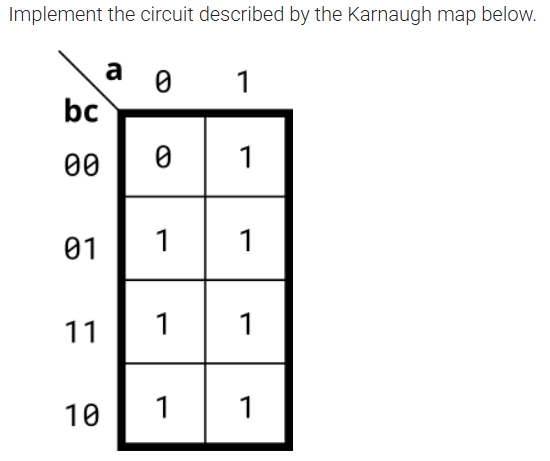
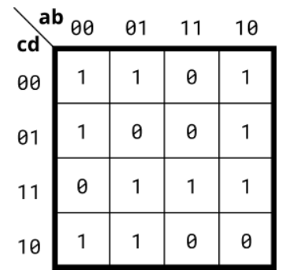
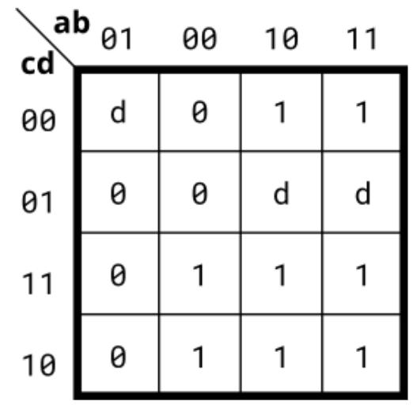
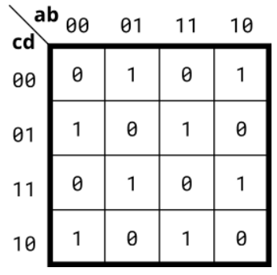
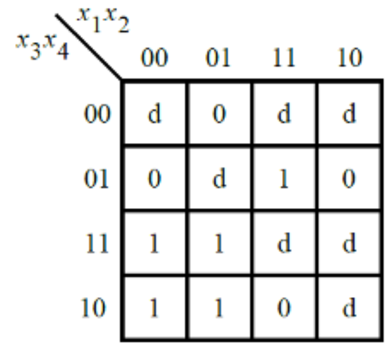
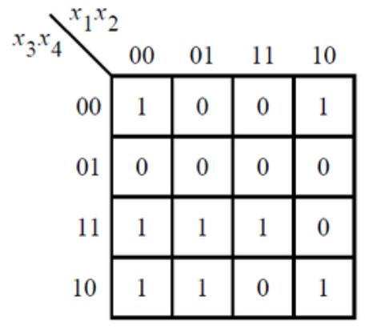
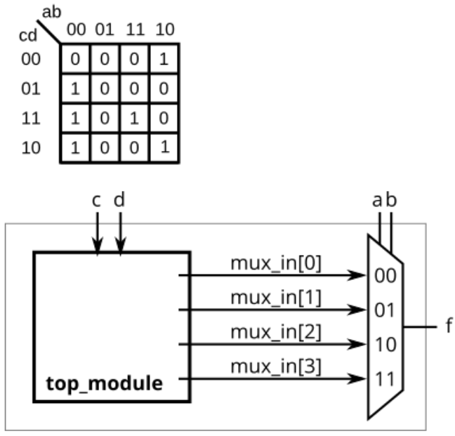

## 📌 Introduction

### 🧮 Method 1：SOP（Sum of Products，最常見的化簡法）

#### Steps

1. 找出 **1 的群組**（可為 1、2、4、8 格，只要是 2^n 個相鄰 1）。
2. 對每個群組寫出積項（AND），保留不變的變數，刪掉變化的變數。
3. 所有積項用加號（OR）連接起來。


### 🧮 Method 2：POS（Product of Sums）

#### Steps

1. 找出 **0 的群組**（可為 1、2、4、8 格，只要是 2^n 個相鄰 0）。
2. 對每個群組寫出和項（OR），保留不變的變數並取，刪掉變化的變數。
3. 所有和項用乘號（AND）連接起來。


## 🧑‍💻 Code Example

### Kmap1
<!--  -->


```verilog
module top_module(
    input a,
    input b,
    input c,
    output out  ); 
	assign out = a | b | c;
endmodule
```

## Kmap2
<!--  -->


### SOP
```verilog
module top_module(
    input a,
    input b,
    input c,
    input d,
    output out  ); 
    //assign out = ( a&~b&d | b&c&d | ~b&~c | ~a&~d );
    assign out = (~b & ~c) | (~a & ~d) | (c & d & (a | b));
endmodule
```
> Use POS aspect look ```cd``` column.

### POS
```verilog
module top_module(
    input a,
    input b,
    input c,
    input d,
    output out  ); 
    assign out = (~a|~b|c) & (~b|c|~d) & (a|b|~c|~d) & (~a|~c|d);
endmodule
```

## Kmap3
<!--  -->


### SOP
```verilog
module top_module(
    input a,
    input b,
    input c,
    input d,
    output out  ); 
    assign out = a | (~a&~b&c);
endmodule
```

### POS
```verilog
module top_module(
    input a,
    input b,
    input c,
    input d,
    output out  ); 
    assign out = (a|c) & (c|~d) & (a|~b);
endmodule
```

## Kmap4
<!--  -->


```verilog
module top_module(
    input a,
    input b,
    input c,
    input d,
    output out  ); 
	assign out = a ^ b ^ c ^ d;
endmodule
```
> It is a simple logic function, but one that can't be easily expressed as SOP nor POS forms.

## ece241_2013_q2
A single-output digital system with four inputs (a,b,c,d) generates a logic-1 when 2, 7, or 15 appears on the inputs, and a logic-0 when 0, 1, 4, 5, 6, 9, 10, 13, or 14 appears. The input conditions for the numbers 3, 8, 11, and 12 never occur in this system. For example, 7 corresponds to a,b,c,d being set to 0,1,1,1, respectively.
```verilog
module top_module (
    input a,
    input b,
    input c,
    input d,
    output out_sop,
    output out_pos
); 
    assign out_sop = (c&d)|(~a&~b&c);
    assign out_pos = (c) & (~b|~c|d) & (~a|b|~c);

endmodule
```

## m2014_q3
<!--  -->


```verilog
module top_module (
    input [4:1] x, 
    output f );
    assign f = (~x[1]&x[3]) | (x[2]&x[4]);
endmodule
```

## 2012_q1g
<!--  -->


### SOP
```verilog
module top_module (
    input [4:1] x,
    output f
); 
    assign f = (~x[1]&x[3]) | (~x[2]&x[3]&~x[4]) | (x[2]&x[3]&x[4]) | (~x[2]&~x[3]&~x[4]);
endmodule
```

### POS
```verilog
module top_module (
    input [4:1] x,
    output f
); 
    assign f = (~x[2]|x[3])&(x[3]|~x[4])&(~x[1]|x[2]|~x[4])&(~x[1]|~x[2]|x[4]);
endmodule
```

## ece241_2014_q3
<!--  -->


```
module top_module (
    input c,
    input d,
    output [3:0] mux_in
); 
    assign mux_in[0] = (c|d);
    assign mux_in[1] = 1'b0;
    assign mux_in[2] = ~d;
    assign mux_in[3] = c&d;

endmodule
```
> Be careful mux_in[2] is ```a=1, b=0```, mux_in[3] is ```a=1, b=1```.


## 📚 Reference
* [HDLBits Problem - Kmap1](https://hdlbits.01xz.net/wiki/Kmap1)
* [HDLBits Problem - Kmap2](https://hdlbits.01xz.net/wiki/Kmap2)
* [HDLBits Problem - Kmap3](https://hdlbits.01xz.net/wiki/Kmap3)
* [HDLBits Problem - Kmap4](https://hdlbits.01xz.net/wiki/Kmap4)
* [HDLBits Problem - ece241_2013_q2](https://hdlbits.01xz.net/wiki/Exams/ece241_2013_q2)
* [HDLBits Problem - m2014_q3](https://hdlbits.01xz.net/wiki/Exams/m2014_q3)
* [HDLBits Problem - 2012_q1g](https://hdlbits.01xz.net/wiki/Exams/2012_q1g)
* [HDLBits Problem - ece241_2014_q3](https://hdlbits.01xz.net/wiki/Exams/ece241_2014_q3)
