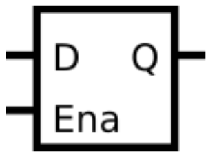
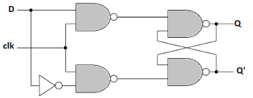

## 📌 Introduction
<!--  -->


<!--  -->


A **D latch** is a *level-sensitive* sequential element.  
Unlike flip-flops, which are *edge-triggered*, latches respond to the level of the enable signal.  
In Verilog, a D latch is described using a **level-sensitive sensitivity list** (`always @(*)`), and since it is a sequential element, **non-blocking assignments (`<=`)** should be used.

When the latch is **enabled**, it acts like a transparent buffer — the output follows the input.  
When **disabled**, it holds (latches) its previous value.

## 🧑‍💻 Code Example

```verilog
module top_module (
    input d, 
    input ena,
    output q);
    
    always @ (*) begin
        if (ena)
            q<=d;
    end

endmodule
```

## 📚 Reference
* [HDLBits Problem - m2014_q4a](https://hdlbits.01xz.net/wiki/Exams/m2014_q4a)
