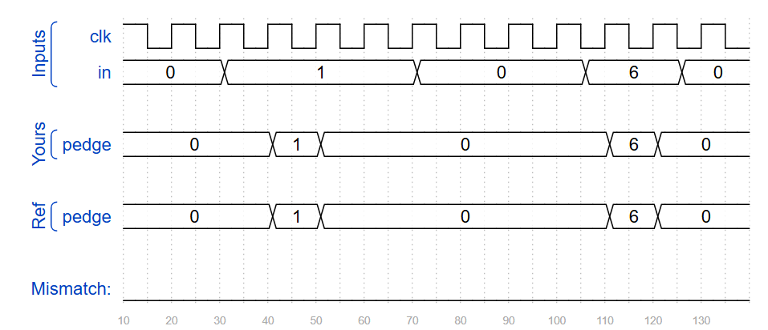
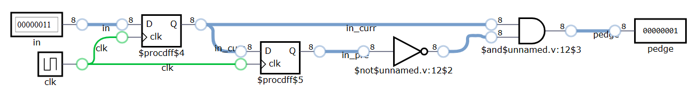
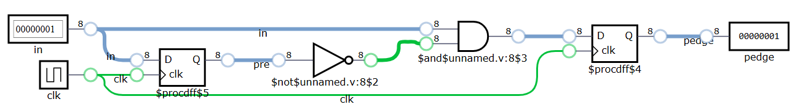

## 📌 Introduction

* Detect **0 → 1 transition** (positive edge) for each bit in an 8-bit input.
* Store both **current** and **previous** states of the signal.
* Output `pedge` goes high **for one clock cycle** after a rising edge.
* Two implementation styles:
  1. **Two flip-flop version** → clearer signal flow (separate current/previous).
  2. **One flip-flop version** → more compact (update and detect in one always block).
* Formula:  
  `pedge = current & ~previous`
* Usage:
  - Detecting push-button press  
  - Event trigger or interrupt edge  
  - Synchronizing asynchronous signals


## 🧑‍💻 Code Example
For each bit in an 8-bit vector, detect when the input signal changes from 0 in one clock cycle to 1 the next (similar to positive edge detection). The output bit should be set the cycle after a 0 to 1 transition occurs.

### **Two flip-flop version**
```verilog
module top_module (
    input clk,
    input [7:0] in,
    output [7:0] pedge
);
    reg [7:0] in_curr, in_pre;
    always @ (posedge clk) begin
        in_pre <= in_curr;
        in_curr <= in;
    end
    
    assign pedge = in_curr & ~in_pre;

endmodule
```
<!--  -->


<!--  -->


### **One flip-flop version**
```verilog
module top_module (
    input clk,
    input [7:0] in,
    output reg [7:0] pedge
);
    reg [7:0] pre;
    always @ (posedge clk) begin
        pedge <= in & ~pre;
        pre <= in;
    end

endmodule
```
<!--  -->


## 🧩 DigitalJS Note

* The diagram is generated by **DigitalJS**, which visualizes the RTL structure after synthesis by **Yosys**.
* Although this version of code looks like “one flip-flop”, the synthesized circuit still has **two DFFs**:
  - One for storing `pre` (previous input)
  - One for storing `pedge` (edge pulse output)
* This is **correct behavior** — both signals need to be held across clock cycles.
* DigitalJS shows RTL-level connections, not real gate-level or timing-optimized results.
* In real FPGA/ASIC synthesis (e.g., Quartus, Vivado), the same two flip-flops will appear.

## 📚 Reference
* [HDLBits Problem - Edgedetect](https://hdlbits.01xz.net/wiki/Edgedetect)
* [DigitalJS Online](https://digitaljs.tilk.eu/)
