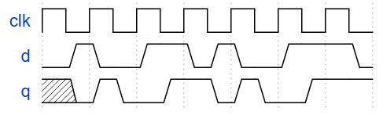
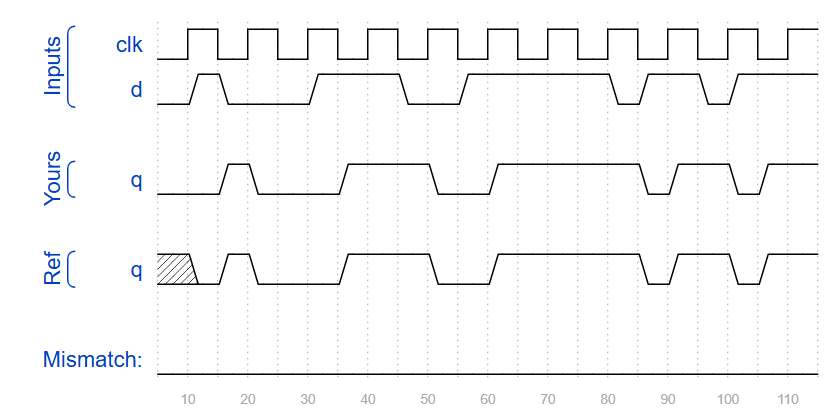
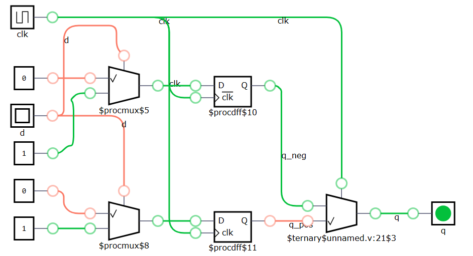

## 📌 Question
You're familiar with flip-flops that are triggered on the positive edge of the clock, or negative edge of the clock. A dual-edge triggered flip-flop is triggered on both edges of the clock. However, FPGAs don't have dual-edge triggered flip-flops, and always @(posedge clk or negedge clk) is not accepted as a legal sensitivity list.

Build a circuit that functionally behaves like a dual-edge triggered flip-flop:
<!--  -->


(Note: It's not necessarily perfectly equivalent: The output of flip-flops have no glitches, but a larger combinational circuit that emulates this behaviour might. But we'll ignore this detail here.)

### Hint
* You can't create a dual-edge triggered flip-flop on an FPGA. But you can create both positive-edge triggered and negative-edge triggered flip-flops.
* This problem is a moderately difficult circuit design problem, but requires only basic Verilog language features. (This is a circuit design problem, not a coding problem.) It may help to first sketch a circuit by hand before attempting to code it.

## 🧑‍💻 Code Example

```verilog
module top_module (
    input clk,
    input d,
    output q
);
    reg q_pos, q_neg;
    always @ (posedge clk) begin
        if (d)
            q_pos <= 1'b1;
        else
            q_pos <= 1'b0;
    end
    
    always @ (negedge clk) begin
       if (d)
            q_neg <= 1'b1;
        else
            q_neg <= 1'b0;
    end
    
    assign q = (clk)? q_pos : q_neg;

endmodule
```
<!--  -->


<!--  -->


## 📚 Reference
* [HDLBits Problem - Dualedge](https://hdlbits.01xz.net/wiki/Dualedge)
* [DigitalJS Online](https://digitaljs.tilk.eu/)
