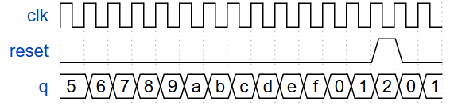
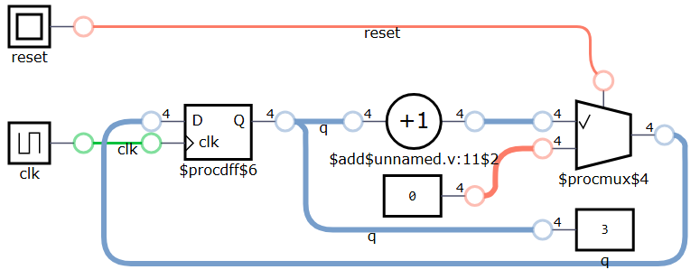

## 📌 Question
Build a 4-bit binary counter that counts from 0 through 15, inclusive, with a period of 16. The reset input is synchronous, and should reset the counter to 0.
<!--  -->


## 🧑‍💻 Code Example

```verilog
module top_module (
    input clk,
    input reset,      // Synchronous active-high reset
    output reg [3:0] q);
    
    always @ (posedge clk) begin
        if (reset) begin
           q <= 4'b0;
        end
        else begin
           q <= q + 1'b1; 
        end
    end

endmodule
```
<!--  -->


## 📚 Reference
* [HDLBits Problem - Count15](https://hdlbits.01xz.net/wiki/Count15)
* [DigitalJS Online](https://digitaljs.tilk.eu/)
