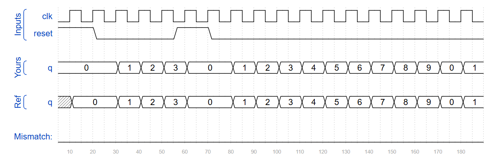
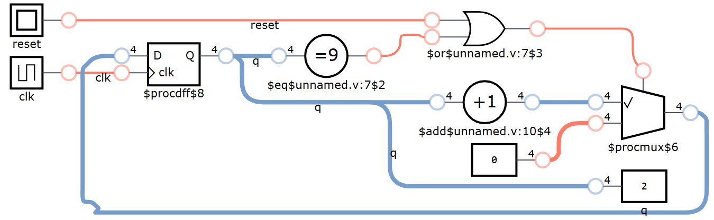
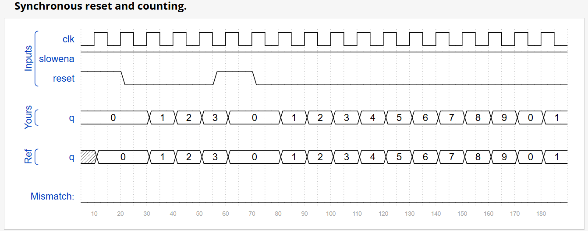
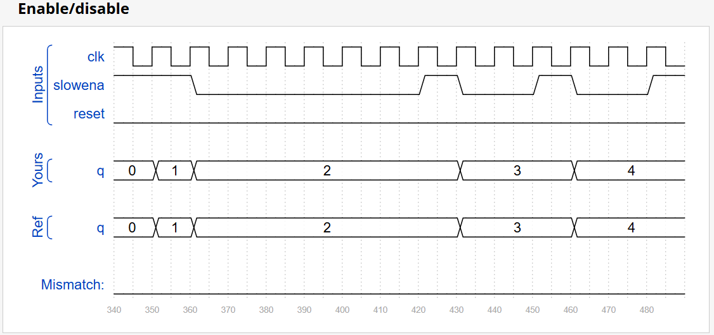

## 📌 Question

### Decade Counter
Build a decade counter that counts from 0 through 9, inclusive, with a period of 10. The reset input is synchronous, and should reset the counter to 0.

### Slow Decade Counter
Build a decade counter that counts from 0 through 9, inclusive, with a period of 10. The reset input is synchronous, and should reset the counter to 0. We want to be able to pause the counter rather than always incrementing every clock cycle, so the slowena input indicates when the counter should increment.

## 🧑‍💻 Code Example

### Decade Counter
```verilog
module top_module (
    input clk,
    input reset,        // Synchronous active-high reset
    output reg [3:0] q);
    
    always @ (posedge clk) begin
        if (reset | q==4'd9)
            q <= 4'b0;
        else
            q <= q + 4'b1;
    end

endmodule
```
<!--  -->


<!--  -->


### Slow Decade Counter
```verilog
module top_module (
    input clk,
    input slowena,
    input reset,
    output reg [3:0] q);
	
    always @ (posedge clk) begin
        if (reset)
            q <= 4'b0;
        else if (slowena) begin
            if (q==4'h9)
                q <= 4'b0;
            else
           		q <= q + 4'b1; 
        end
    end
    
endmodule
```

<!--  -->


<!--  -->


## 📚 Reference
* [HDLBits Problem - Count10](https://hdlbits.01xz.net/wiki/Count10)
* [HDLBits Problem - Countslow](https://hdlbits.01xz.net/wiki/Countslow)
* [DigitalJS Online](https://digitaljs.tilk.eu/)
