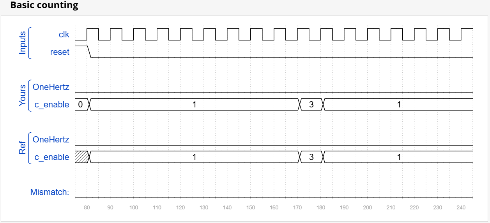
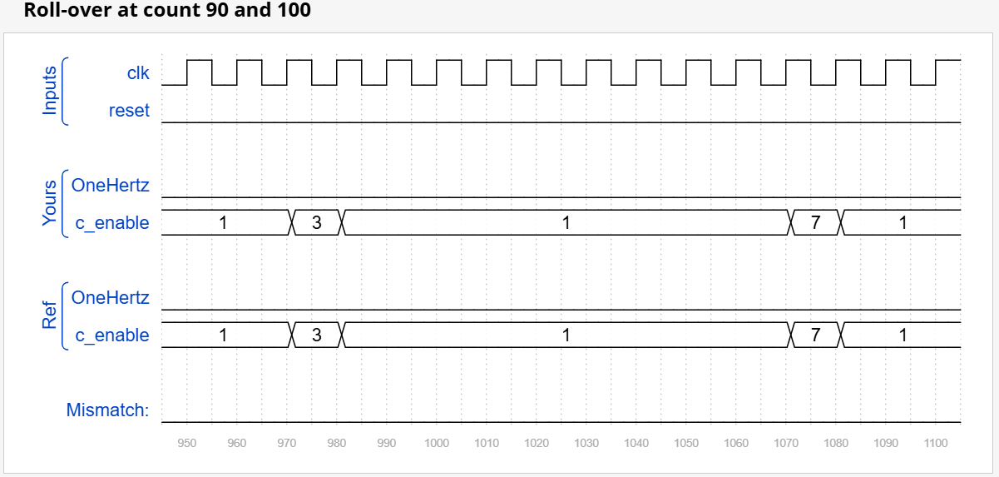
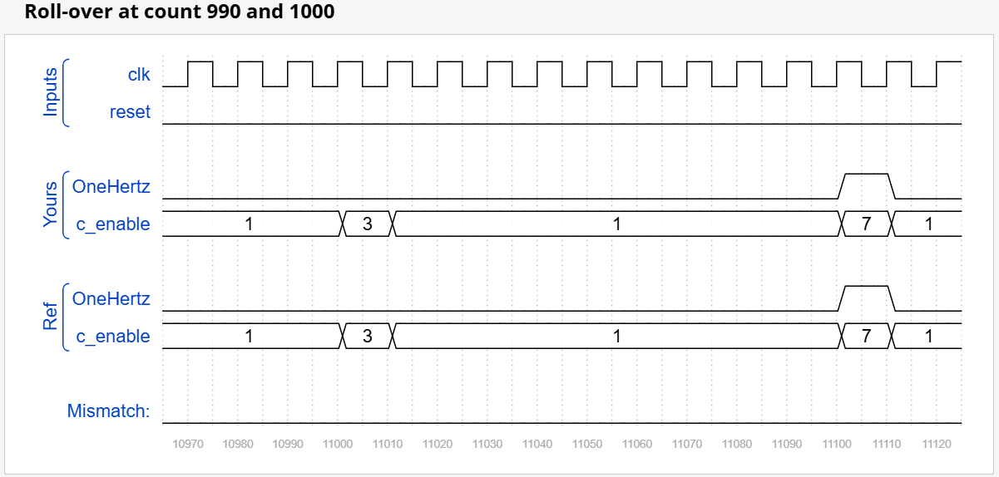

## 📌 Question
From a 1000 Hz clock, derive a 1 Hz signal, called OneHertz, that could be used to drive an Enable signal for a set of hour/minute/second counters to create a digital wall clock. Since we want the clock to count once per second, the OneHertz signal must be asserted for exactly one cycle each second. Build the frequency divider using modulo-10 (BCD) counters and as few other gates as possible. Also output the enable signals from each of the BCD counters you use (c_enable[0] for the fastest counter, c_enable[2] for the slowest).

The following BCD counter is provided for you. Enable must be high for the counter to run. Reset is synchronous and set high to force the counter to zero. All counters in your circuit must directly use the same 1000 Hz signal.

module bcdcount (
    input clk,
    input reset,
    input enable,
    output reg [3:0] Q
);

## 🧑‍💻 Code Example

```verilog
module top_module (
    input clk,
    input reset,
    output OneHertz,
    output [2:0] c_enable
); 
    wire [3:0] out0, out1, out2;
    assign c_enable[0] = ~reset;
    assign c_enable[1] = c_enable[0] & (out0==4'h9);
    assign c_enable[2] = c_enable[1] & (out1==4'h9);
    assign OneHertz = c_enable[2] & (out2==4'h9);
    bcdcount counter0 (clk, reset, c_enable[0], out0);
    bcdcount counter1 (clk, reset, c_enable[1], out1);
    bcdcount counter2 (clk, reset, c_enable[2], out2);

endmodule
```
> Synchronous Cascaded Divider

<!--  -->


<!--  -->


<!--  -->


## 📚 Reference
* [HDLBits Problem - ece241_2014_q7b](https://hdlbits.01xz.net/wiki/Exams/ece241_2014_q7b)
