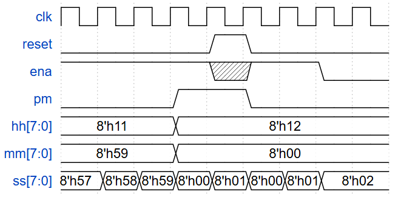

## 📌 Question
Create a set of counters suitable for use as a 12-hour clock (with am/pm indicator). Your counters are clocked by a fast-running clk, with a pulse on ena whenever your clock should increment (i.e., once per second).

reset resets the clock to 12:00 AM. pm is 0 for AM and 1 for PM. hh, mm, and ss are two BCD (Binary-Coded Decimal) digits each for hours (01-12), minutes (00-59), and seconds (00-59). Reset has higher priority than enable, and can occur even when not enabled.

The following timing diagram shows the rollover behaviour from 11:59:59 AM to 12:00:00 PM and the synchronous reset and enable behaviour.



## 🧑‍💻 Code Example

### BCD Counter
```verilog
module Hours_counter(input clk, input reset, input ena, output [7:0] hour);
    always @ (posedge clk) begin
        if (reset) begin
           hour <= 8'h12;
        end
        else if (ena) begin
            if (hour==8'h12)
                hour <= 8'h01;
            else if (hour==8'h09)
                hour <= 8'h10;
            else
            	hour <= hour + 8'h01;
        end
    end
endmodule

module Minutes_counter(input clk, input reset, input ena, output [7:0] minute);
    always @ (posedge clk) begin
        if (reset) begin
           minute <= 8'h00;
        end
        else if (ena) begin
            if (minute==8'h59)
                minute <= 8'h0;
            else if ((minute & 8'h0F) == 8'h09)
                minute <= (minute & 8'hF0) + 8'h10;
            else
            	minute <= minute + 8'h01;
        end
    end
endmodule

module Seconds_counter(input clk, input reset, input ena, output [7:0] second);
    always @ (posedge clk) begin
        if (reset) begin
           second <= 8'h00;
        end
        else if (ena) begin
            if (second==8'h59)
                second <= 8'h0;
            else if ((second & 8'h0F) == 8'h09)
                second <= (second & 8'hF0) + 8'h10;
            else
            	second <= second + 8'h01;
        end
    end
endmodule

module top_module(
    input clk,
    input reset,
    input ena,
    output pm,
    output [7:0] hh,
    output [7:0] mm,
    output [7:0] ss); 
	
    wire [7:0] s, m, h;
    wire mm_ena = (ena && (s==8'h59));
    wire hh_ena = (mm_ena && (m==8'h59));
    reg pm_i;
    always @ (posedge clk) begin
        if (reset)
            pm_i <= 1'b0;
        else if (hh_ena & (h==8'h11)) begin
           pm_i <= ~pm_i; 
        end
    end
    assign pm = pm_i;
    assign ss = s;
    assign mm = m;
    assign hh = h;
    Seconds_counter ss_counter(.clk(clk), .reset(reset), .ena(ena), .second(s) );
    Minutes_counter mm_counter(.clk(clk), .reset(reset), .ena(mm_ena), .minute(m) );
    Hours_counter   hh_counter(.clk(clk), .reset(reset), .ena(hh_ena), .hour(h) );
endmodule
```

### By Ordinary Counter
```verilog
module Hours_counter(input clk, input reset, input ena, output [7:0] hour);
    always @ (posedge clk) begin
        if (reset) begin
           hour <= 8'h0C;
        end
        else if (ena) begin
            if (hour==8'hC)
                hour <= 8'h01;
            else
            	hour <= hour + 8'h01;
        end
    end
endmodule

module Minutes_counter(input clk, input reset, input ena, output [7:0] minute);
    always @ (posedge clk) begin
        if (reset) begin
           minute <= 8'h0;
        end
        else if (ena) begin
            if (minute==8'd59)
                minute <= 8'h0;
            else
            	minute <= minute + 8'h01;
        end
    end
endmodule

module Seconds_counter(input clk, input reset, input ena, output [7:0] second);
    always @ (posedge clk) begin
        if (reset) begin
           second <= 8'h0;
        end
        else if (ena) begin
            if (second==8'd59)
                second <= 8'h0;
            else
            	second <= second + 8'h01;
        end
    end
endmodule

module top_module(
    input clk,
    input reset,
    input ena,
    output pm,
    output [7:0] hh,
    output [7:0] mm,
    output [7:0] ss); 
	
    wire [7:0] s, m, h;
    wire mm_ena = (ena && (s==8'd59));
    wire hh_ena = (mm_ena && (m==8'd59));
    reg pm_i;
    always @ (posedge clk) begin
        if (reset)
            pm_i <= 1'b0;
        else if (hh_ena & (h==8'hB)) begin
           pm_i <= ~pm_i; 
        end
    end
    assign pm = pm_i;
    assign ss = s;
    assign mm = m;
    assign hh = h;
    Seconds_counter ss_counter(.clk(clk), .reset(reset), .ena(ena), .second(s) );
    Minutes_counter mm_counter(.clk(clk), .reset(reset), .ena(mm_ena), .minute(m) );
    Hours_counter   hh_counter(.clk(clk), .reset(reset), .ena(hh_ena), .hour(h) );
endmodule
```

## 📚 Reference
* [HDLBits Problem - Count_clock](https://hdlbits.01xz.net/wiki/Count_clock)
