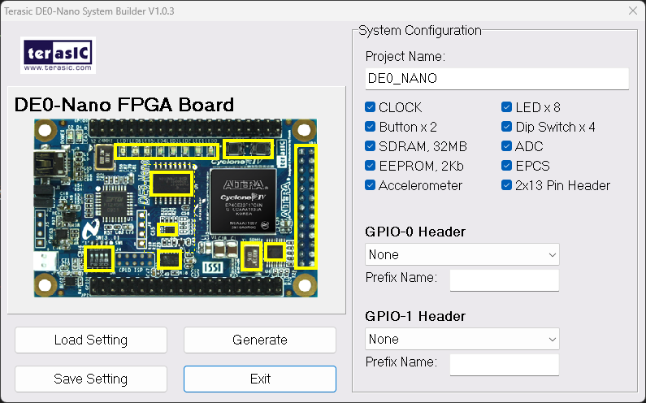
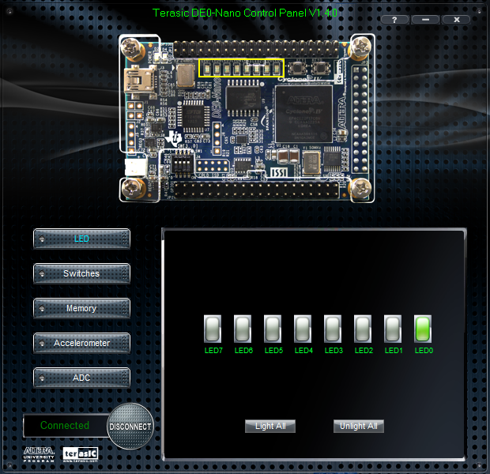
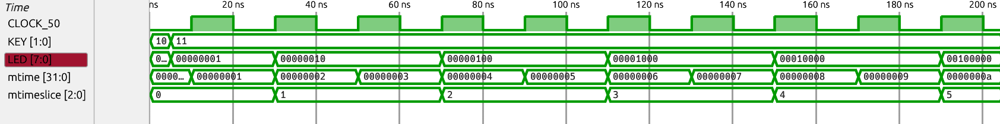
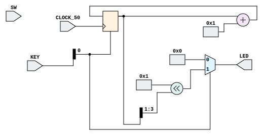
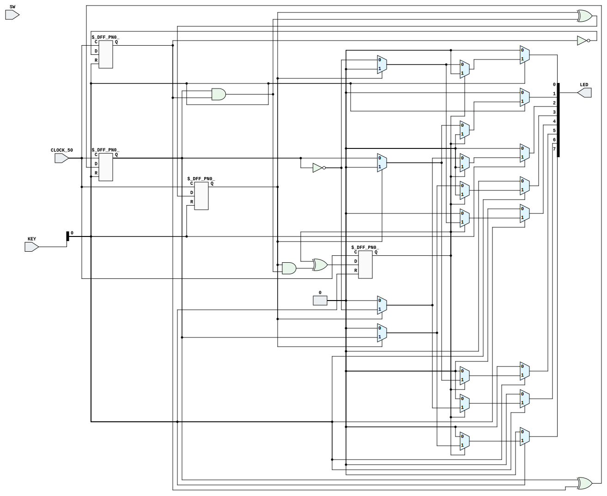
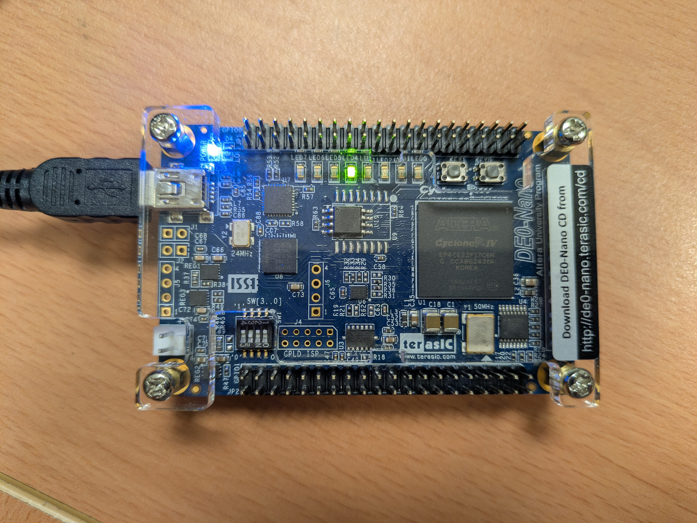

## 📌 目標: 在 WSL 中透過命令列操作 Quartus 工具

對許多開發者來說，Quartus 的 GUI 介面雖然功能強大，但顯得過於笨重且操作瑣碎。為了提升效率，我傾向在 WSL (Windows Subsystem for Linux) 中使用自行搭建的開源 Verilog 編譯模擬環境（如 Icarus Verilog + GTKWave），並在最後階段透過 **CLI (Command Line Interface)** 呼叫 Quartus 進行合成、布局佈線與燒錄，直接將電路部署到 Terasic DE0-Nano 開發板。

## 🛠️ Quartus 核心命令列工具 (CLI)

雖然 Quartus 安裝在 Windows 端，但 WSL 可以直接執行 Windows 的 .exe 檔。這樣做有兩個核心優點：

1. **驅動相容性**：燒錄器（USB-Blaster）在 Windows 下驅動最穩定，免去在 WSL 中複雜的 USB 轉接（attach）手續。
2. **開發一致性**：無論在 Linux Shell 或 Windows CMD 都能維持同一套開發邏輯，不需要在 WSL 額外安裝一套 Quartus。

### 1. 設定系統路徑

編輯 `~/.bashrc`，將 Quartus 的 `bin64` 路徑加入 `PATH`：

```bash
# 請根據您的實際安裝路徑調整版本號 (例如 21.1)
export PATH=$PATH:/mnt/c/intelFPGA_lite/21.1/quartus/bin64/
```

**💡 小撇步：針對 VSCode Non-interactive Shell 的設定**
如果你跟我一樣會使用 VSCode 中的 Task 來呼叫指令，請確保將 `PATH` 設定放在 `.bashrc` 中「非互動式 shell 檢查」的前面，否則 Task 會找不到路徑：

```bash
# 將 PATH 設定放在這行之前
# If not running interactively, don't do anything
case $- in
    *i*) ;;
      *) return;;
esac
```

更新環境變數：`source ~/.bashrc`


### 2. 常用工具對照表

在 WSL 中呼叫時，記得加上 `.exe` 後綴：

| 工具名稱 | 功能說明 | 常用指令範例 |
| --- | --- | --- |
| **quartus_sh** | 腳本編譯流程 (完整 Flow) | `quartus_sh.exe --flow compile <proj>` |
| **quartus_map** | 分析與分析 (Synthesis) | `quartus_map.exe <proj>` |
| **quartus_fit** | 佈局與佈線 (Place & Route) | `quartus_fit.exe <proj>` |
| **quartus_asm** | 產生燒錄檔 (.sof / .pof) | `quartus_asm.exe <proj>` |
| **quartus_sta** | 時序分析 (Static Timing) | `quartus_sta.exe <proj>` |
| **quartus_pgm** | 裝置燒錄 (Programming) | `quartus_pgm.exe -m jtag -o "p;file.sof"` |


## 💡 自動化編譯與燒錄腳本

為了簡化流程，我撰寫了兩支 Bash 腳本。專案目錄架構如下：

```text
.
├── rtl/           # Verilog 源碼
├── sim/           # 模擬測試檔
├── output_files/  # 編譯輸出的 .sof 檔
├── build.sh       # 一鍵編譯腳本
└── program.sh     # 一鍵燒錄腳本
```

### 一鍵編譯 (`build.sh`)

```bash
#!/bin/bash
PROJECT_NAME="fpga_project"

echo "--- Starting Full Compilation Flow ---"
# 使用 --flow compile 會依序執行 map, fit, asm, sta
quartus_sh.exe --flow compile $PROJECT_NAME
```

### 一鍵燒錄 (`program.sh`)

```bash
#!/bin/bash
SOF_FILE="output_files/fpga_project.sof"

echo "Searching for JTAG Hardware..."
quartus_pgm.exe -l

echo "Programming DE0-Nano via USB-Blaster..."
# -m jtag: 使用 JTAG 模式
# -c: 指定硬體名稱 (通常為 "USB-Blaster")
# -o: "p" 代表 Program
quartus_pgm.exe -m jtag -c "USB-Blaster" -o "p;$SOF_FILE"
```

## 🚀 VSCode 整合：`tasks.json`

將上述腳本整合進 VSCode，可以實現「按個快捷鍵就編譯/燒錄」。這是我常用的配置範例，涵蓋了編譯、燒錄以及基於 Conda 環境的開源模擬工具：

```json
{
    "version": "2.0.0",
    "tasks": [
        {
            "label": "🚀 FPGA: Build (Quartus CLI)",
            "type": "shell",
            "command": "./build.sh",
            "options": {
                "cwd": "${workspaceFolder}"
            },
            "group": {
                "kind": "build",
                "isDefault": false
            },
            "presentation": {
                "reveal": "always",
                "panel": "dedicated",
                "focus": true,
                "close": false
            },
            "problemMatcher": [],
            "detail": "執行 Tcl 設定並呼叫 Quartus Flow 進行全編譯。"
        },
        {
            "label": "⚡ FPGA: Program (USB-Blaster)",
            "type": "shell",
            "command": "./program.sh",
            "options": {
                "cwd": "${workspaceFolder}"
            },
            "group": "none",
            "presentation": {
                "reveal": "always",
                "panel": "dedicated",
                "focus": true,
                "close": false
            },
            "problemMatcher": [],
            "detail": "使用 quartus_pgm 將 .sof 燒錄至 DE0-Nano。"
        },
        {
            "label": "🪄 Simulate (make all)",
            "type": "shell",
            "command": "conda run -n Open_EDA make all",
            "options": {
                "cwd": "${workspaceFolder}/sim"
            },
            "group": {
                "kind": "build",
                "isDefault": false
            },
            "presentation": {
                "close": false,              
                "showReuseMessage": false 
            },
            "problemMatcher": [],
            "detail": "Clean, compile RTL and Testbench, and run the simulation in the Open_EDA env."
        },
        {
            "label": "📈 View Waveform (make wave)",
            "type": "shell",
            "command": "conda run -n Open_EDA make wave",
            "group": "none",
            "presentation": {
                "close": true, 
                "showReuseMessage": false 
            },
            "options": {
                "cwd": "${workspaceFolder}/sim"
            },
            "problemMatcher": [],
            "detail": "Open GTKWave to view the simulation results in the Open_EDA env."
        },
        {
            "label": "💡 Synthesize (make synth)",
            "type": "shell",
            "command": "conda run -n Open_EDA make synth",
            "group": "none",
            "presentation": {
                "close": true, 
                "showReuseMessage": false 
            },
            "options": {
                "cwd": "${workspaceFolder}/sim"
            },
            "problemMatcher": [],
            "detail": "Run Yosys synthesis and generate schematics in the Open_EDA env."
        },
        {
            "label": "🧹 Clean (make clean)",
            "type": "shell",
            "command": "conda run -n Open_EDA make clean",
            "group": "none",
            "presentation": {
                "close": true, 
                "showReuseMessage": false 
            },
            "options": {
                "cwd": "${workspaceFolder}/sim"
            },
            "problemMatcher": [],
            "detail": "Remove all generated files in the Open_EDA env."
        },
        {
            "label": "🔎 Run Gemini CLI",
            "type": "shell",
            "command": "conda run --no-capture-output -n Open_EDA gemini",
            "group": "none",
            "presentation": {
                "reveal": "always",
                "panel": "new",
                "focus": true, 
                "echo": true,
                "close": false
            },
            "problemMatcher": [],
            "detail": "Launch the Gemini CLI in a new interactive terminal."
        }
    ]
}
```


## 🧑‍💻 實作範例：跑馬燈

我將此次實作範例放在 Github 上，網址 [Brandon-git-hub/Q-CLI - Scrolling LED](https://github.com/Brandon-git-hub/Q-CLI/tree/0a9e1f1489240af274c67d67b590a06f3c381f5b)。

我使用的是 **Terasic DE0-Nano**。推薦使用官方提供的 [DE0-Nano System Builder](https://www.terasic.com.tw/cgi-bin/page/archive.pl?Language=Taiwan&CategoryNo=173&No=603&PartNo=4#contents) 來快速生成 `.qsf` 約束文件，省去手動分配 Pin 腳的麻煩。

<!--  -->
<p align="center">

</p>

### 驅動程式檢查

若電腦未識別開發板，請至裝置管理員手動更新驅動，路徑指向： `C:\intelFPGA_lite\<版本>\quartus\drivers`

此外，建議下載 **Control Panel** 工具，初期測試硬體（如 LED、Switch）是否運作正常。

<!--  -->
<p align="center">

</p>

### RTL 核心邏輯

這是一個簡單的位移暫存器，透過 `DIVIDER` 參數控制跑馬燈速度：

```verilog
//=======================================================
//  This code is generated by Terasic System Builder
//=======================================================

module fpga_project
#(
	parameter WIDTH = 32,
	parameter DIVIDER = 1 // Real Run:25
) (

	//////////// CLOCK //////////
	CLOCK_50,

	//////////// LED //////////
	LED,

	//////////// KEY //////////
	KEY,

	//////////// SW //////////
	SW 
);

//=======================================================
//  PARAMETER declarations
//=======================================================
localparam HIGH = DIVIDER + 2; 

//=======================================================
//  PORT declarations
//=======================================================

//////////// CLOCK //////////
input 		          		CLOCK_50;

//////////// LED //////////
output		     [7:0]		LED;

//////////// KEY //////////
input 		     [1:0]		KEY;

//////////// SW //////////
input 		     [3:0]		SW;


//=======================================================
//  REG/WIRE declarations
//=======================================================
reg [WIDTH-1:0] mtime;
wire [2:0] mtimeslice = mtime[HIGH:DIVIDER];

//=======================================================
//  Structural coding
//=======================================================

always @ (posedge CLOCK_50 or negedge KEY[0]) begin
	if (!KEY[0]) mtime <= 'd0;
	else mtime <= mtime + 'd1;
end

assign LED = (KEY[0]) ?(8'd1 << mtimeslice) : 8'd0;

endmodule
```

### TestBench

```verilog
`timescale 1ns/1ps

module tb_fpga_project();

    reg  CLOCK_50;
    wire [7:0]   LED;
    reg  [1:0]   KEY;
    reg  [3:0]   SW;

    // 實例化被測設計 (DUT)
    fpga_project dut (
        .CLOCK_50(CLOCK_50),
        .LED(LED),
        .KEY(KEY),
        .SW(SW)
    );

    initial begin
        CLOCK_50 = 0;
        forever #10 CLOCK_50 = ~CLOCK_50;
    end

    // 測試流程
    initial begin
        // Initialize Inputs
        KEY = 2'b10;
        SW  = 'd0;

        #5;
        KEY[0] = 1;
        $display("Test Start.");

        #200;
        
        $display("Test Finished.");
        $finish;
    end

    // 產生波形檔供
    initial begin
        $dumpfile("tb_fpga_project.vcd");
        $dumpvars(0, tb_fpga_project);
    end

endmodule
```

### Waveform

<!--  -->

<p align="center">

</p>

### RTL Schematic

<!--  -->

<p align="center">

</p>

### Gate-level Schematic

<!--  -->

<p align="center">

</p>

## 🔬 實測結果

實際在 FPGA 上跑時，將 `DIVIDER` 設為 `25`（將 50 MHz 除以 $2^{25}$），LED 大約每 1.5 秒位移一次。

<!--  -->

<p align="center">

</p>

## 📚 Reference
* [Quartus Prime Pro Edition User Guide Scripting](https://docs.altera.com/r/docs/683432/25.3.1/quartus-prime-pro-edition-user-guide-scripting/answers-to-top-faqs)
* [Altera DE0-Nano 開發平台](https://www.terasic.com.tw/cgi-bin/page/archive.pl?Language=Taiwan&CategoryNo=145&No=603)
* [Altera DE0-Nano 開發平台 - 設計資源](https://www.terasic.com.tw/cgi-bin/page/archive.pl?Language=Taiwan&CategoryNo=173&No=603&PartNo=4#contents)
* [Brandon-git-hub/Q-CLI - Scrolling LED](https://github.com/Brandon-git-hub/Q-CLI/tree/0a9e1f1489240af274c67d67b590a06f3c381f5b)
