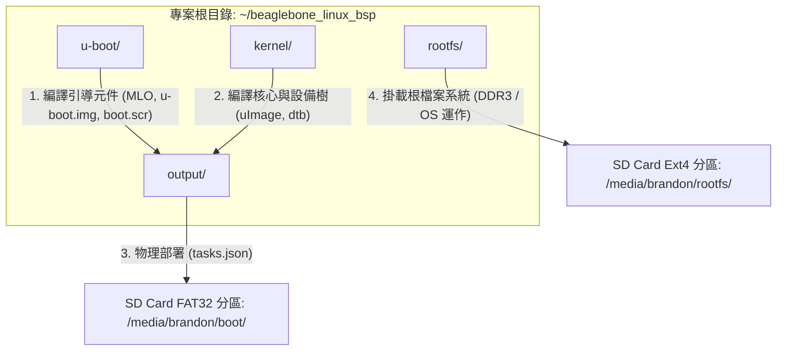
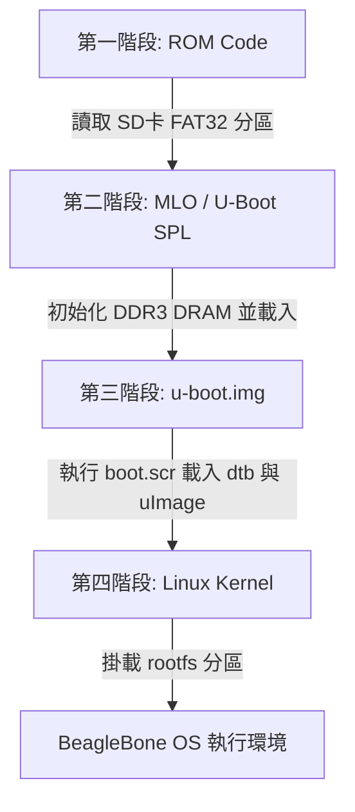

```mermaid
graph TD
    subgraph Root [專案根目錄: ~/beaglebone_linux_bsp]
        UB[u-boot/]
        KE[kernel/]
        OUT[output/]
        RF[rootfs/]
    end

    UB -- "1. 編譯引導元件 (MLO, u-boot.img, boot.scr)" --> OUT
    KE -- "2. 編譯核心與設備樹 (uImage, dtb)" --> OUT
    OUT -- "3. 物理部署 (tasks.json)" --> SD_FAT32[SD Card FAT32 分區: /media/brandon/boot/]
    RF -- "4. 掛載根檔案系統 (DDR3 / OS 運作)" --> SD_EXT4[SD Card Ext4 分區: /media/brandon/rootfs/]
```

```mermaid
graph TD
    A[第一階段: ROM Code] -- 讀取 SD卡 FAT32 分區 --> B[第二階段: MLO / U-Boot SPL]
    B -- 初始化 DDR3 DRAM 並載入 --> C[第三階段: u-boot.img]
    C -- 執行 boot.scr 載入 dtb 與 uImage --> D[第四階段: Linux Kernel]
    D -- 掛載 rootfs 分區 --> E[BeagleBone OS 執行環境]
```