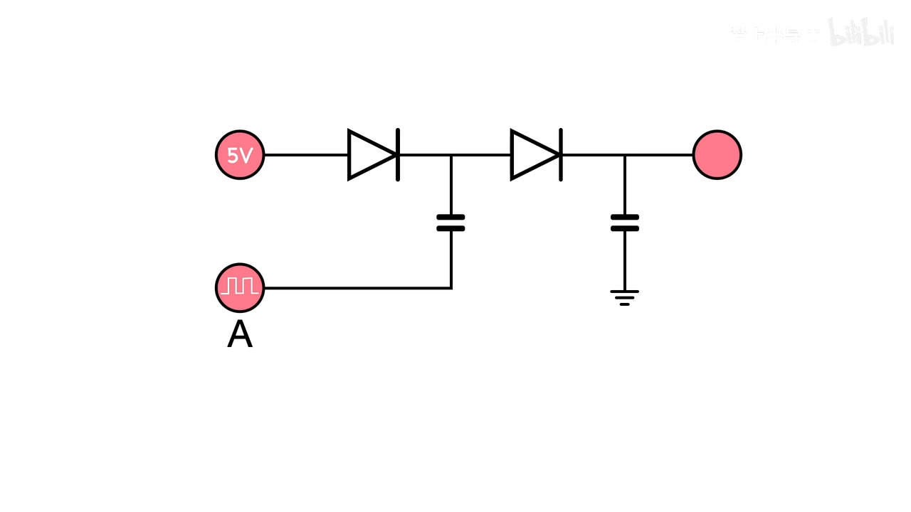
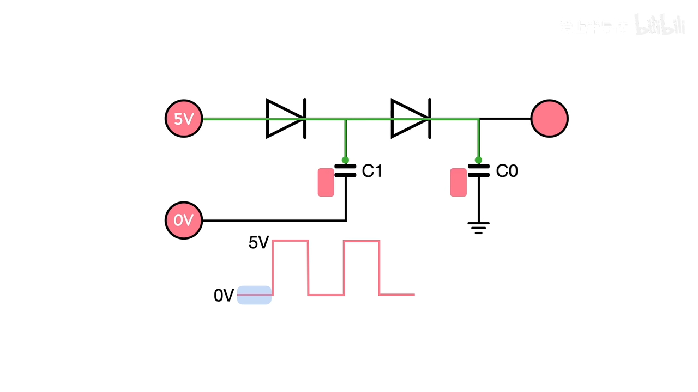
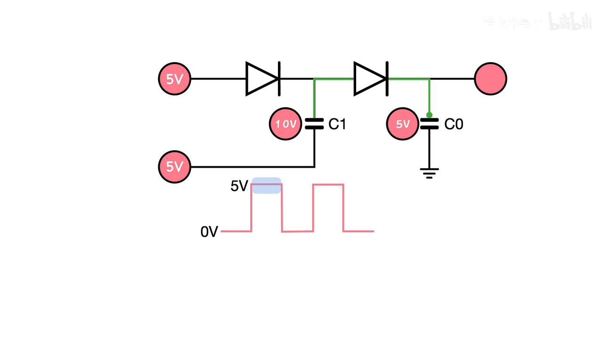
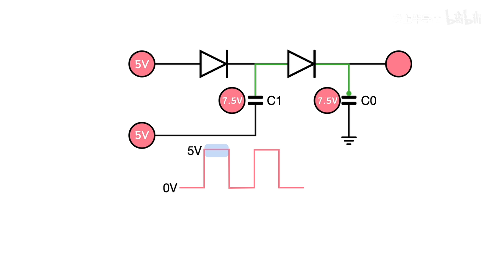
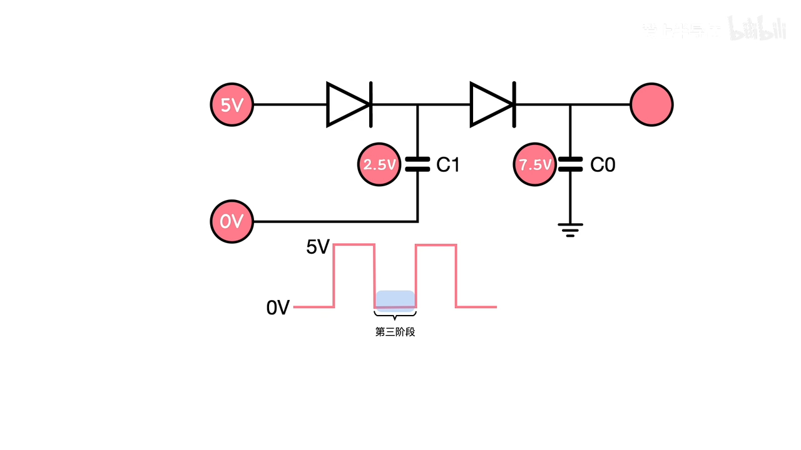
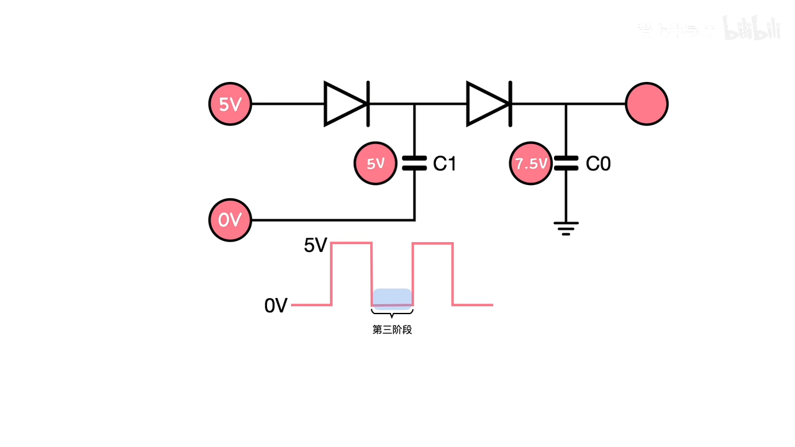
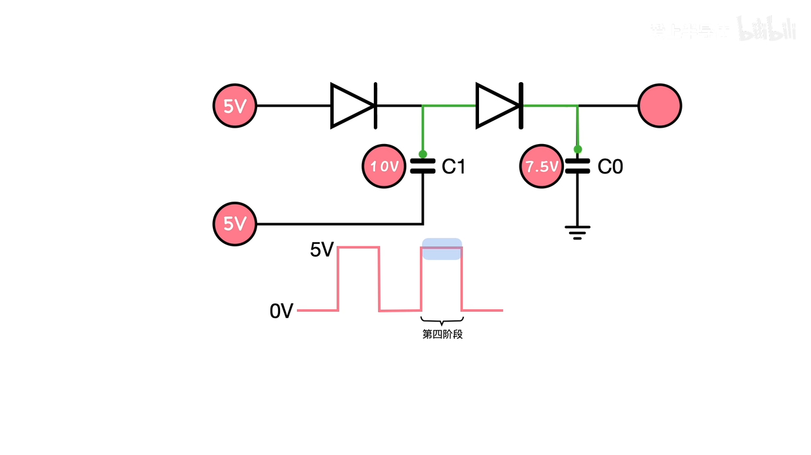
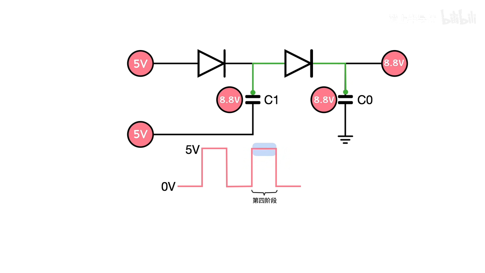
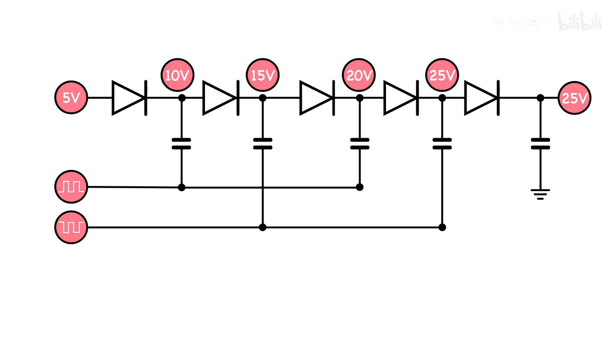

## 📌 Introduction
The Dickson charge pump is a well-known voltage multiplier circuit that uses capacitors and clock phases to boost voltage. It operates in several stages where charge is transferred step by step.

### One Stage Example

#### First Step

#### Second Step

> Charge sharing

#### Third Step

#### Fourth Step

### Multi-Stage

## 📚 Reference
* [电荷泵是如何升压的？原理非常简单，一看就会！](https://www.bilibili.com/video/BV1xX4y1F7Lp/?spm_id_from=333.337)
