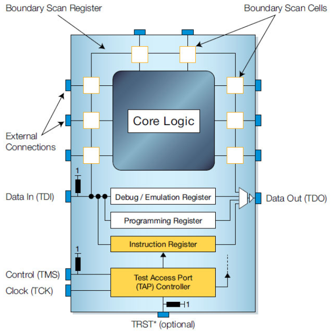

## 📌 Joint Test Action Group

* TCK (Test Clock) – this signal synchronizes the internal state machine operations.
TMS (Test Mode Select) – this signal is sampled at the rising edge of TCK to determine the next state.
* TDI (Test Data In) – this signal represents the data shifted into the device’s test or programming logic. It is sampled at the rising edge of TCK when the internal state machine is in the correct state.
* TDO (Test Data Out) – this signal represents the data shifted out of the device’s test or programming logic and is valid on the falling edge of TCK when the internal state machine is in the correct state.
* TRST (Test Reset) – this is an optional pin which, when available, can reset the TAP controller’s state machine.

## 📚 Reference
* [XJTAG - What is JTAG and how can I make use of it?](https://www.xjtag.com/about-jtag/what-is-jtag/?v=255a5cac7685)
* [XJTAG - Technical Guide to JTAG](https://www.xjtag.com/about-jtag/jtag-a-technical-overview/?v=255a5cac7685)
