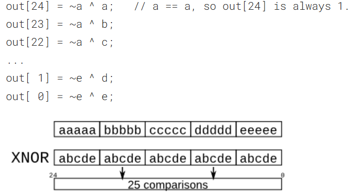

## 📌 Vector Replication
```verilog
module top_module (
    input [7:0] in,
    output [31:0] out );

    assign out = { {24{in[7]}}, in[7:0]};

endmodule
```
Notice that ```24{in[7]}```must be wrapped in ```{}``` because of its vector return.

## 🧑‍💻 Code Example

```verilog
module top_module (
    input a, b, c, d, e,
    output [24:0] out );//

    // The output is XNOR of two vectors created by 
    // concatenating and replicating the five inputs.
    assign out = ~{{5{a}}, {5{b}}, {5{c}}, {5{d}}, {5{e}} } ^ {5{a, b, c, d, e}};

endmodule
```


## 📚 Reference
[HDLBits Problem - Vector4](https://hdlbits.01xz.net/wiki/Vector4)
[HDLBits Problem - Vector5](https://hdlbits.01xz.net/wiki/Vector5)
