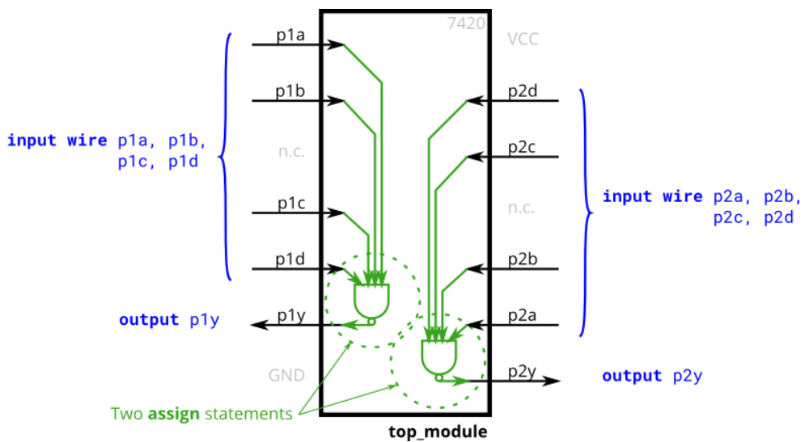
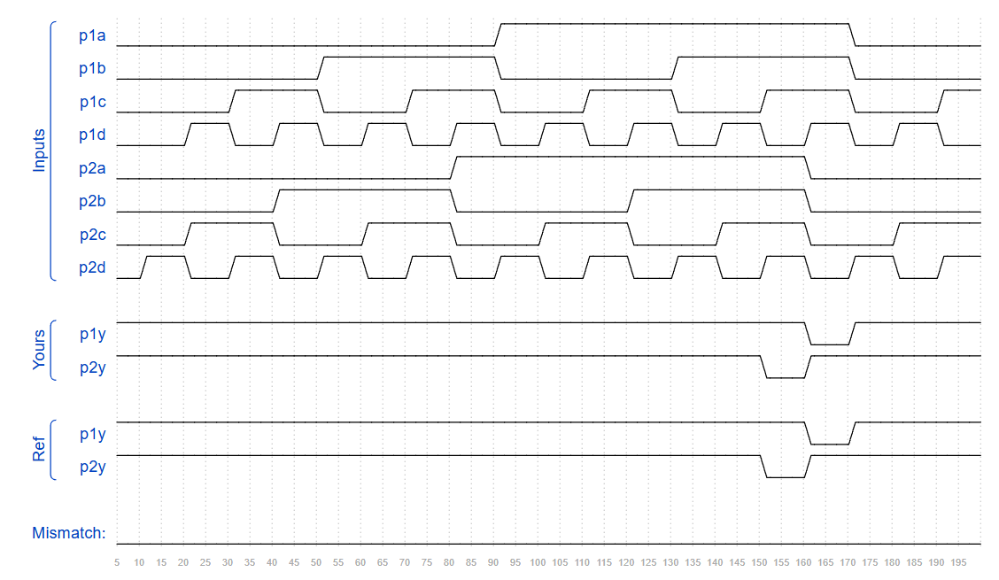

## 📌 Introduction

### 7420

The 7420 is a chip with two 4-input NAND gates.

## 🧑‍💻 Code Example

```verilog
module top_module ( 
    input p1a, p1b, p1c, p1d,
    output p1y,
    input p2a, p2b, p2c, p2d,
    output p2y );
	
    assign p1y = ~(p1a & p1b & p1c & p1d);
    assign p2y = ~(p2a & p2b & p2c & p2d);

endmodule
```




## 📚 Reference
* [HDLBits Problem - 7420](https://hdlbits.01xz.net/wiki/7420)
