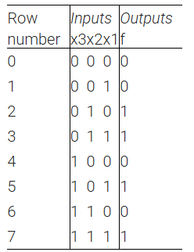

## 📌 Introduction

## 🧑‍💻 Code Example

### Sum-of-products form
```verilog
module top_module( 
    input x3,
    input x2,
    input x1,  // three inputs
    output f   // one output
);
    wire row2, row3 ,row5, row7;
    assign row2 = !x3 & x2 & !x1; // 010
    assign row3 = !x3 & x2 & x1;  // 011
    assign row5 = x3 & !x2 & x1;  // 101
    assign row7 = x3 & x2 &x1;    // 111
    assign f = row2 | row3 | row5 | row7;

endmodule
```

### Miniterm
```verilog
module top_module( 
    input x3,
    input x2,
    input x1,  // three inputs
    output f   // one output
);
    assign f = ~x3 & x2 | x3 & x1;

endmodule
```


## Simplification Process (Sum-of-Products → Minimal Form)

Starting from the canonical SOP expression:

```
f = ~x3*x2*~x1 + ~x3*x2*x1 + x3*~x2*x1 + x3*x2*x1
```

---

### Step 1. Group terms with common factors

**Group 1:**

```
~x3*x2*~x1 + ~x3*x2*x1
= ~x3*x2*(~x1 + x1)
= ~x3*x2*(1)
= ~x3*x2
```

**Group 2:**

```
x3*~x2*x1 + x3*x2*x1
= x3*x1*(~x2 + x2)
= x3*x1*(1)
= x3*x1
```

---

### Step 2. Combine the simplified groups

```
f = ~x3*x2 + x3*x1
```

---

### Step 3. Final minimal form

```
f = x2 + x3*x1
```

---

### Verilog Implementation

```verilog
assign f = x2 | (x3 & x1);
```

---

### Optional: K-map Verification

Plotting minterms (2, 3, 5, 7) on a 3-variable Karnaugh map shows two groups:

* One group where x2 = 1
* Another group where x3 and x1 are both 1

Hence, the simplified form `f = x2 + x3*x1` is verified correct.


## 📚 Reference
* [HDLBits Problem - Truthtable1](https://hdlbits.01xz.net/wiki/Truthtable1)
