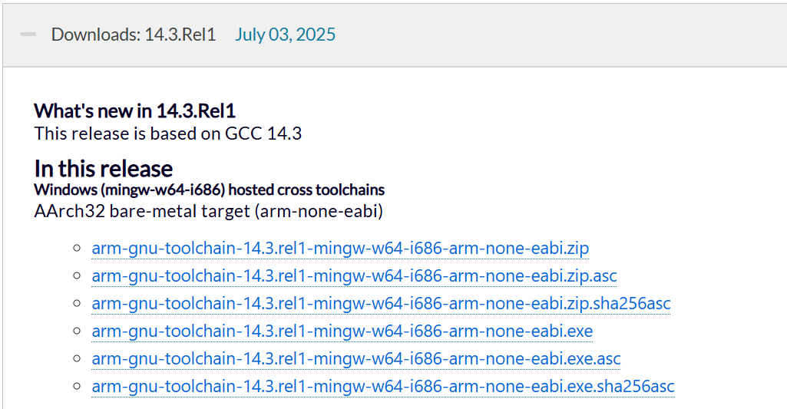

## 📌 Installation

### 🧩 1. Install Arm GNU Toolchain

Source：
🔗 **[Arm Developer – GNU Arm Embedded Toolchain](https://developer.arm.com/downloads/-/arm-gnu-toolchain-downloads)**

#### ✅ Version Suggestion (Windows)

> **Windows x86_64 hosted cross compiler for Arm Cortex-M and Cortex-R processors (bare-metal target)**

> choose .exe, and tick ```add to env path``` after installation completed.

### 🧠 2. CMD
| CMD                      | Function               | Note                   |
| ----------------------- | ---------------- | -------------------- |
| `arm-none-eabi-gcc`     | C/C++ Compiler        |  For ARM Cortex-M (baremetal) |
| `arm-none-eabi-as`      | assembler              | `.s` file            |
| `arm-none-eabi-ld`      | linker              | linker script     |
| `arm-none-eabi-objcopy` | ELF → BIN/HEX | Build Programmable file               |
| `arm-none-eabi-size`    | Display section size           | text/data/bss size     |
| `arm-none-eabi-gdb`     | Debugger              | Connect ST-LINK/OpenOCD   |


## 🧑‍💻 3. Simple Code Example
A minimal bare‑metal template targeting **STM32F072 (Cortex‑M0)**. No HAL, no CMSIS pack required.

> **128 KB Flash** and **16 KB RAM** (STM32F072VBT6).

### 📁 Directory layout
```
STM32_baremetal/
├─ inc/
│  └─ device.h
├─ src/
│  ├─ main.c
│  └─ startup_stm32f072.s
├─ linker.ld
└─ Makefile
```

### 📝 4. Makefile
```makefile
# === Makefile (part A) ===
# Toolchain (bare‑metal ARM)
CC      := arm-none-eabi-gcc
OBJCOPY := arm-none-eabi-objcopy
OBJDUMP := arm-none-eabi-objdump
SIZE    := arm-none-eabi-size

# Target CPU: Cortex‑M0 (STM32F072)
MCUFLAGS := -mcpu=cortex-m0 -mthumb -mfloat-abi=soft

# Common compile options (no stdlib; freestanding)
CFLAGS  := $(MCUFLAGS) -O0 -g3 -ffreestanding -fno-builtin -Wall -Wextra -Werror
ASFLAGS := $(MCUFLAGS) -g3
LDFLAGS := $(MCUFLAGS) -Wl,-Map=build.map -nostartfiles -Wl,--gc-sections -T linker.ld

# Include path (we will add headers later)
INCLUDES := -Iinc

# For now, do NOT add build rules. We will append them after.
# Try: `make` now — it should fail with "No rule to make target" (expected).
```