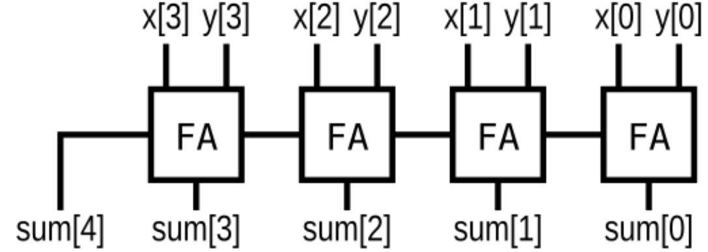

## 📌 Introduction
In digital logic design, **adders** are fundamental building blocks used for performing binary addition.  
A *half adder* adds two single-bit inputs, while a *full adder* also includes a carry-in input.  
By cascading full adders, we can construct a **ripple-carry adder** to handle multi-bit operations.

## Categories
* [Ripple-Carry Adder](https://brandon-git-hub.github.io/TechBlog/docs/day6.html)
* [Carry-select adder](https://brandon-git-hub.github.io/TechBlog/docs/day7.html)
* [BCD ripple-carry adder](https://brandon-git-hub.github.io/TechBlog/docs/day21.html)
* [Adder–subtractor](https://brandon-git-hub.github.io/TechBlog/docs/day8.html)


## 🧑‍💻 Code Example

### Half Adder
```verilog
module top_module( 
    input a, b,
    output cout, sum );
	assign cout = a & b;
    assign sum  = a ^ b;
endmodule
```

### Full Adder
```verilog
module top_module( 
    input a, b, cin,
    output cout, sum );
    assign cout = (a & b) | (a & cin) | (b & cin);
    assign sum  = a ^ b ^ cin;
endmodule
```

### 3-bit Binary Ripple-Carry Adder
```verilog
module Fadd( 
    input a, b, cin,
    output cout, sum );
    assign cout = (a & b) | (a & cin) | (b & cin);
    assign sum  = a ^ b ^ cin;
endmodule

module top_module( 
    input [2:0] a, b,
    input cin,
    output [2:0] cout,
    output [2:0] sum );
    
    Fadd Add0(.a(a[0]), .b(b[0]), .cin(cin), .cout(cout[0]), .sum(sum[0]));
    Fadd Add1(.a(a[1]), .b(b[1]), .cin(cout[0]), .cout(cout[1]), .sum(sum[1]));
    Fadd Add2(.a(a[2]), .b(b[2]), .cin(cout[1]), .cout(cout[2]), .sum(sum[2]));
	
endmodule
```

### 4-bit Binary Ripple-Carry Adder

```verilog
module FA(input a, input b, input cin, output sum, output cout);
	assign sum = a ^ b ^ cin;
    assign cout = (a & b) | (a & cin) | (b & cin);
endmodule

module top_module (
    input [3:0] x,
    input [3:0] y, 
    output [4:0] sum);
    wire [2:0] cout;
    FA add0(.a(x[0]), .b(y[0]), .cin(1'b0), .sum(sum[0]), .cout(cout[0]));
    FA add1(.a(x[1]), .b(y[1]), .cin(cout[0]), .sum(sum[1]), .cout(cout[1]));
    FA add2(.a(x[2]), .b(y[2]), .cin(cout[1]), .sum(sum[2]), .cout(cout[2]));
    FA add3(.a(x[3]), .b(y[3]), .cin(cout[2]), .sum(sum[3]), .cout(sum[4]));
endmodule
```

### Signed Addition Overflow (Two's Complement)
Definition: Overflow occurs when the carry into the MSB differs from the carry out of the MSB,
or equivalently when adding two numbers with the same sign produces a result with the opposite sign.

### My Answer
```verilog
module top_module (
    input [7:0] a,
    input [7:0] b,
    output [7:0] s,
    output overflow
); //
 
    assign s = a + b;
    assign overflow = ((a[7]==1'b0 & b[7]==1'b0 & s[7]==1'b1) 
                       | (a[7]==1'b1 & b[7]==1'b1 & s[7]==1'b0));

endmodule
```

### Best Answer
```verilog
module top_module (
    input [7:0] a,
    input [7:0] b,
    output [7:0] s,
    output overflow
); 
    wire [8:0] sum_extended = {1'b0, a} + {1'b0, b};
    assign s = sum_extended[7:0];
    
    // Cin_7 = Sum_7 ^ a[7] ^ b[7]
    assign overflow = sum_extended[8] ^ sum_extended[7] ^ a[7] ^ b[7]; 

endmodule
``` 
> If the carry into bit 7 and the carry out of bit 7 are different, overflow occurs.

### 100-bit Binary Adder
```verilog
module top_module( 
    input [99:0] a, b,
    input cin,
    output cout,
    output [99:0] sum );
    assign {cout, sum} = {1'b0, a} + {1'b0, b} + {100'b0, cin};
endmodule
```
> behavioral code

### 4-bit BCD adder (ripple-carry)

#### My Answer
```verilog
module bcd(input [3:0] a, b,
           input cin,
           output reg cout,
           output reg [3:0] sum);
    wire [4:0] temp_sum = {1'b0, a} + {1'b0, b} + {4'b0, cin};
    always @(*) begin
        cout = 1'b0;
        sum = 4'b0;
        if (temp_sum>=5'd10) begin
            {cout, sum} = temp_sum - 5'd10;
            cout = 1'b1;
        end
        else begin
            {cout, sum} = temp_sum;
        end
    end
endmodule

module top_module ( 
    input [15:0] a, b,
    input cin,
    output cout,
    output [15:0] sum );
	
    genvar i;
    wire [4:0] c;
    assign c[0] = cin;
    generate
        for (i=0; i<4; i++) begin:Bcdadd4
            bcd add(.a(a[4*i+3:4*i]), .b(b[4*i+3:4*i]), .cin(c[i]), 
                    .cout(c[i+1]), .sum(sum[4*i+3:4*i]));
        end
    endgenerate
    assign cout = c[4];
endmodule
```

#### +6 Answer
```verilog
module bcd(input [3:0] a, b,
           input cin,
           output reg cout,
           output reg [3:0] sum);
    wire [4:0] temp_sum = {1'b0, a} + {1'b0, b} + {4'b0, cin};
    always @(*) begin
        cout = 1'b0;
        sum = temp_sum[3:0];
        if (temp_sum>9) begin
            {cout, sum} = temp_sum + 5'd6; // force hex carry, 10->16
        end
    end
endmodule
```

```verilog
module bcd(input [3:0] a, b,
           input cin,
           output cout,
           output [3:0] sum);
    wire [4:0] temp_sum = {1'b0, a} + {1'b0, b} + {4'b0, cin};
    assign {cout, sum} = (temp_sum>9) ? temp_sum + 5'd6 : temp_sum;
    
endmodule
```
> * The BCD representation for the 5-digit decimal number 12345 is 20'h12345. This is not the same as 14'd12345 (which is 14'h3039).
> * The circuit is structured just like a binary ripple-carry adder, except the adders are base-10 rather than base-2.

## 📚 Reference
* [HDLBits Problem - Hadd](https://hdlbits.01xz.net/wiki/Hadd)
* [HDLBits Problem - Fadd](https://hdlbits.01xz.net/wiki/Fadd)
* [HDLBits Problem - Adder3](https://hdlbits.01xz.net/wiki/Adder3)
* [HDLBits Problem - m2014_q4j](https://hdlbits.01xz.net/wiki/Exams/m2014_q4j)
* [HDLBits Problem - ece241_2014_q1c](https://hdlbits.01xz.net/wiki/Exams/ece241_2014_q1c)
* [HDLBits Problem - Adder100](https://hdlbits.01xz.net/wiki/Adder100)
* [HDLBits Problem - Bcdadd4](https://hdlbits.01xz.net/wiki/Bcdadd4)
