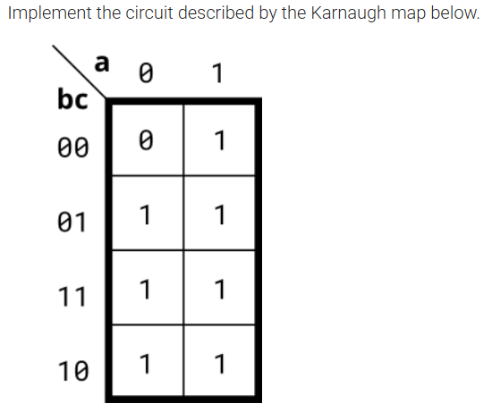

## 📌 Introduction

### 🧮 Method 1：SOP（Sum of Products，最常見的化簡法）

#### Steps

1. 找出 **1 的群組**（可為 1、2、4、8 格，只要是 2^n 個相鄰 1）。
2. 對每個群組寫出積項（AND），保留不變的變數，刪掉變化的變數。
3. 所有積項用加號（OR）連接起來。


### 🧮 Method 2：POS（Product of Sums）

#### Steps

1. 找出 **0 的群組**（可為 1、2、4、8 格，只要是 2^n 個相鄰 0）。
2. 對每個群組寫出和項（OR），保留不變的變數並取，刪掉變化的變數。
3. 所有和項用乘號（AND）連接起來。


## 🧑‍💻 Code Example

### Kmap1

```verilog
module top_module(
    input a,
    input b,
    input c,
    output out  ); 
	assign out = a | b | c;
endmodule
```

## Kmap2

### SOP
```verilog
module top_module(
    input a,
    input b,
    input c,
    input d,
    output out  ); 
    //assign out = ( a&~b&d | b&c&d | ~b&~c | ~a&~d );
    assign out = (~b & ~c) | (~a & ~d) | (c & d & (a | b));
endmodule
```
> Use POS aspect look ```cd``` column.

### POS
```verilog
module top_module(
    input a,
    input b,
    input c,
    input d,
    output out  ); 
    assign out = (~a|~b|c) & (~b|c|~d) & (a|b|~c|~d) & (~a|~c|d);
endmodule
```

## 📚 Reference
* [HDLBits Problem - Kmap1](https://hdlbits.01xz.net/wiki/Kmap1)
* [HDLBits Problem - Kmap2](https://hdlbits.01xz.net/wiki/Kmap2)