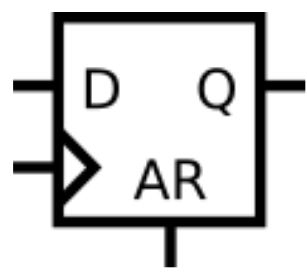
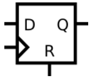

## 📌 **Introduction**
This note compares two common D flip-flop designs — one with an **asynchronous reset** and one with a **synchronous reset**.

- **Asynchronous reset**: The output `q` is immediately cleared to `0` when the reset signal is asserted, regardless of the clock.  
  This is often used for global power-on reset circuits.

- **Synchronous reset**: The reset only takes effect on the clock’s rising edge.  
  It avoids metastability issues during reset release and is more suitable for synthesis and timing control.

| Type | Sensitivity List | Reset Timing | Typical Use |
|------|------------------|---------------|--------------|
| **Asynchronous Reset** | `@(posedge clk or posedge ar)` | Immediate | Power-on reset, quick fault recovery |
| **Synchronous Reset** | `@(posedge clk)` | On next clock edge | Regular sequential logic, easier STA |


## 🧑‍💻 Code Example

### Asynchronous Reset DFF

```verilog
module top_module (
    input clk,
    input d, 
    input ar,   // asynchronous reset
    output q);
    
    always @(posedge clk, posedge ar) begin
        if (ar)
            q<=1'b0;
        else
            q<=d;
    end
endmodule
```

### Synchronous Reset DFF

```verilog
module top_module (
    input clk,
    input d, 
    input r,   // synchronous reset
    output q);
    
    always @(posedge clk) begin
        if (r)
            q<=1'b0;
        else 
            q<=d;
    end

endmodule
```

## 📚 Reference
* [HDLBits Problem - m2014_q4b](https://hdlbits.01xz.net/wiki/Exams/m2014_q4b)
* [HDLBits Problem - m2014_q4c](https://hdlbits.01xz.net/wiki/Exams/m2014_q4c)
