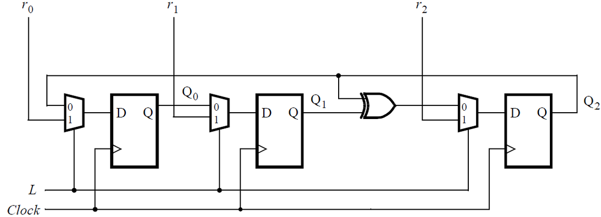
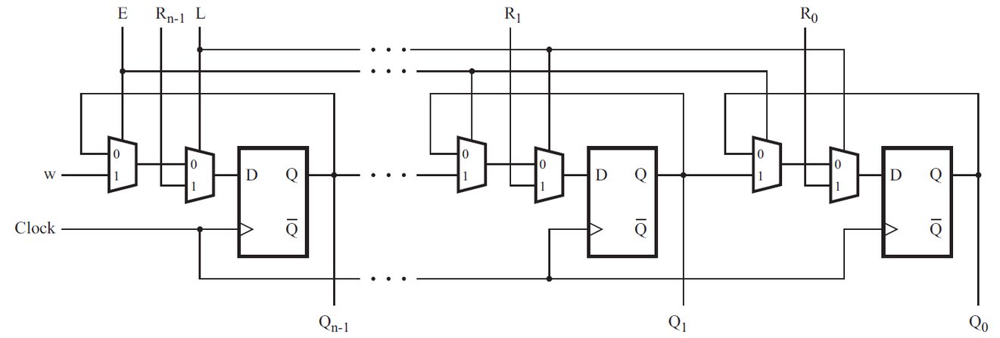
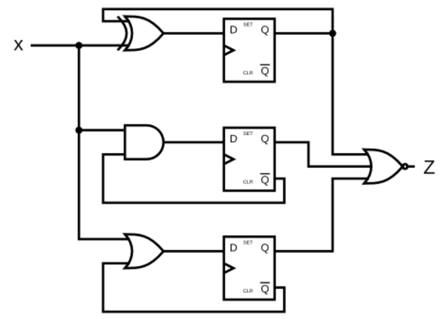

<p><small>🗓️ {{ page.date | date: "%Y-%m-%d" }}</small></p>

## 📌 Introduction
In this exercise, I explore how D flip-flops interact with basic gates and multiplexers to form sequential circuits.

## 🧑‍💻 Code Example

### DFF + Gate

```verilog
module top_module (
    input clk,
    input in, 
    output reg out);
	
    always @(posedge clk) begin
       out <= out ^ in;
    end
endmodule
```

### Mux and DFF

> Implement hierarchical Verilog code for this circuit, using three instantiations of a submodule that has a flip-flop and multiplexer in it. 
> Write a Verilog module (containing one flip-flop and multiplexer) named top_module for this submodule.

```verilog
module top_module (
	input clk,
	input L,
	input r_in,
	input q_in,
	output reg Q);
    
    always @ (posedge clk) begin
        Q <= (L)? r_in : q_in; 
    end

endmodule
```

### Mux and DFF (2)

```verilog
module top_module (
    input clk,
    input w, R, E, L,
    output reg Q
);
    
    always @ (posedge clk) begin
        Q <= (L)? R : ((E)? w : Q);
    end

endmodule
```

### DFFs and Gates

> Given the finite state machine circuit as shown, assume that the D flip-flops are initially reset to zero before the machine begins.
> Be careful with the reset state. Ensure that each D flip-flop's Q output is really the inverse of its Q output, even before the first clock edge of the simulation.

```verilog
module DFF_s(input clk, input D, output reg Q);
    initial Q=1'b0;
    always @ (posedge clk) begin
            Q <= D;
    end
endmodule

module top_module (
    input clk,
    input x,
    output z
); 
    wire Q0, Q1, Q2;
    //wire Q0_bar = ~Q0;
    wire Q1_bar = ~Q1;
    wire Q2_bar = ~Q2;
    DFF_s dff0(.clk(clk), .D( Q0 ^ x), .Q(Q0));
    DFF_s dff1(.clk(clk), .D( Q1_bar & x), .Q(Q1));
    DFF_s dff2(.clk(clk), .D( Q2_bar | x), .Q(Q2));
    assign z = ~(Q0 | Q1 | Q2);
endmodule
```

## 📚 Reference
* [HDLBits Problem - m2014_q4d](https://hdlbits.01xz.net/wiki/Exams/m2014_q4d)
* [HDLBits Problem - Mt2015_muxdff](https://hdlbits.01xz.net/wiki/Mt2015_muxdff)
* [HDLBits Problem - 2014_q4a](https://hdlbits.01xz.net/wiki/Exams/2014_q4a)
* [HDLBits Problem - ece241_2014_q4](https://hdlbits.01xz.net/wiki/Exams/ece241_2014_q4)
