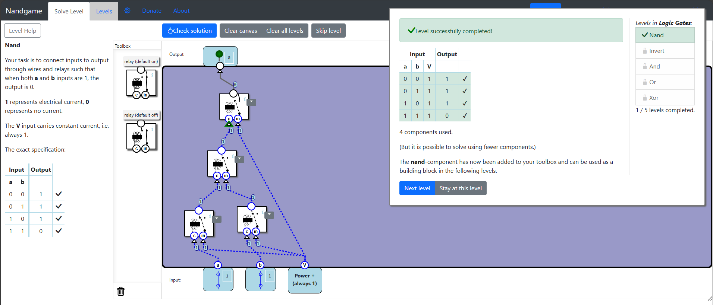
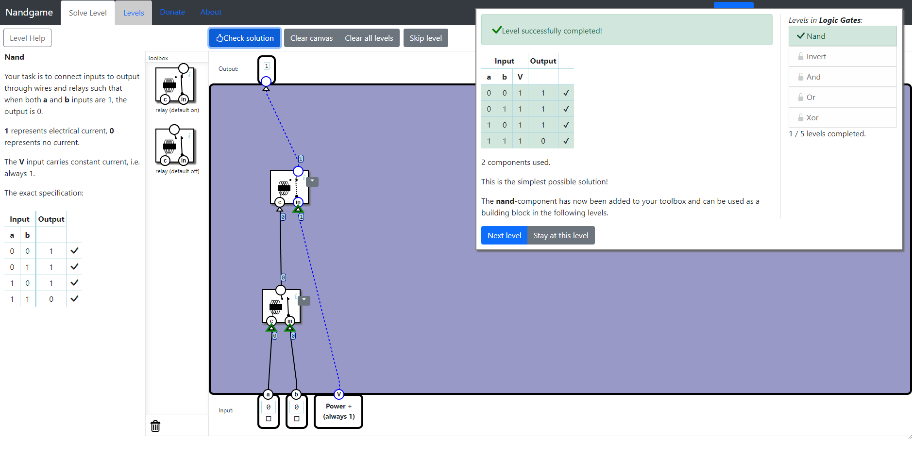

## 📌 Introduction
A **nand-component** (or **nand-gate**) is a fundamental logic component. Using just nand-gates, all computing logic can be built. This is why we start by building a nand-gate!

A **relay** is an electrically controlled switch, where a control signal causes the switch to turn on and off. The control current is connected to an electromagnet which moves a contact between the on and off positions.

The first electronic computers were built from electric relays, but today computers are built from **transistors**. Transistors are switches like relays, but do not have any mechanical parts, which makes them (a lot) smaller, cheaper, and faster. Nandgame uses relays because it is easier to show how they work, but logically relays and transistors are similar. Once we have built the Nand-component, we can ignore whether it is built from relays or transistors.

## 🧑‍💻 Answer Example

### My Answer

### NandGame-Solution

## 📚 Reference
* [Nandgame - Nand](https://nandgame.com/)
* [timlg07 - NandGame-Solutions](https://github.com/timlg07/NandGame-Solutions/)