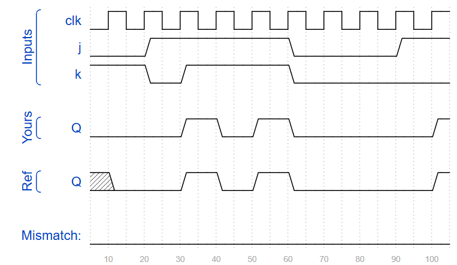

## 📌 Introduction
A **JK flip-flop** is a refinement of the SR flip-flop that eliminates the invalid state.  
It has two inputs, **J** and **K**, and one output **Q**.  
Depending on the input combination, it can hold, set, reset, or toggle its output.

### Truth Table
| J | K | Q(next) | Description |
|------|-------|--------| ------|
| 0 | 0 | Q(old)  | Hold (no change) |
| 0 | 1 | 0       | Reset |
| 1 | 0 | 1       | Set |
| 1 | 1 | ~Q(old) | Toggle |

## 🧑‍💻 Code Example

```verilog
module top_module (
    input clk,
    input j,
    input k,
    output reg Q); 
    
	initial Q = 1'b0;
    always @(posedge clk) begin
        if (j & k)
            Q <= ~Q;
        else if (j)
            Q <= 1'b1;
        else if (k)
            Q <= 1'b0;
        // else: hold current value
    end
endmodule
```



## 📚 Reference
* [HDLBits Problem - ece241_2013_q7](https://hdlbits.01xz.net/wiki/Exams/ece241_2013_q7)
