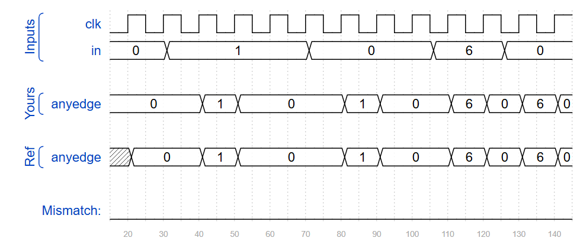
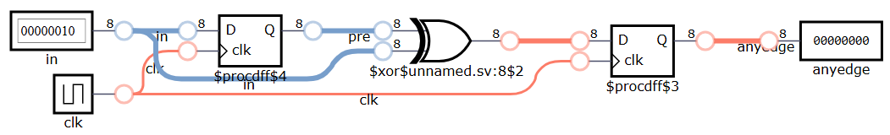

## 📌 Introduction
This example demonstrates how to detect **any edge** (both rising and falling) for each bit in an 8-bit input vector.  
By storing the input from the previous clock cycle and comparing it with the current value, we can determine whether a bit has changed state.  
If a bit toggles (0→1 or 1→0), the output for that bit will be asserted for one clock cycle.

## 🧑‍💻 Code Example

```verilog
module top_module (
    input clk,
    input [7:0] in,
    output reg [7:0] anyedge
);
    reg [7:0] pre;
    always @ (posedge clk) begin
        anyedge <= pre ^ in;
        pre <= in;
    end

endmodule
```




## 📚 Reference
* [HDLBits Problem - Edgedetect2](https://hdlbits.01xz.net/wiki/Edgedetect2)
* [DigitalJS Online](https://digitaljs.tilk.eu/)