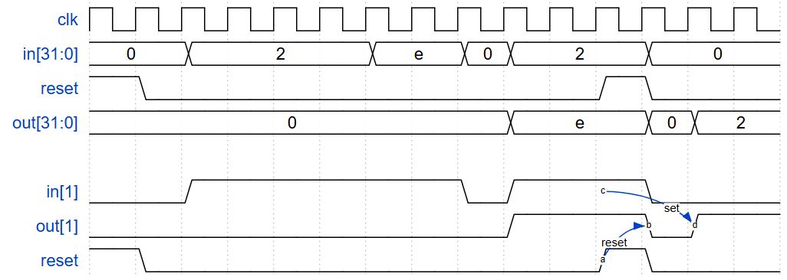
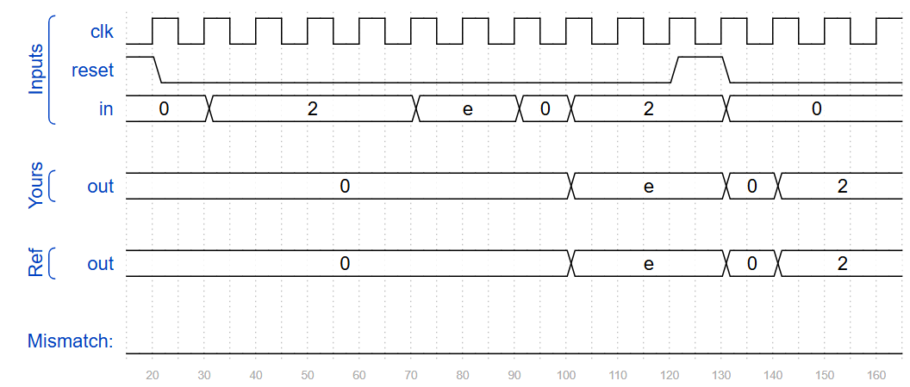
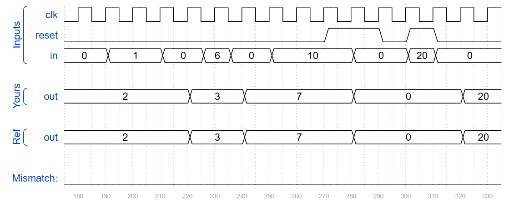
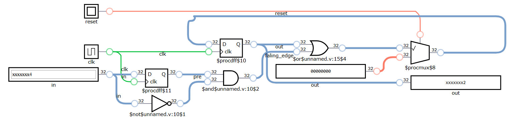

## 📌 Introduction
For each bit in a 32-bit vector, capture when the input signal changes from 1 in one clock cycle to 0 the next. "Capture" means that the output will remain 1 until the register is reset (synchronous reset).

Each output bit behaves like a SR flip-flop: The output bit should be **set** (to 1) the cycle after a 1 to 0 transition occurs. The output bit should be **reset** (to 0) at the positive clock edge when reset is high. If both of the above events occur at the same time, reset has precedence. In the last 4 cycles of the example waveform below, the 'reset' event occurs one cycle earlier than the 'set' event, so there is no conflict here.


## 🧑‍💻 Code Example

```verilog
module top_module (
    input clk,
    input reset,
    input [31:0] in,
    output reg [31:0] out
);
    reg [31:0] pre;
    wire [31:0] falling_edge = pre & ~in;
    always @ (posedge clk) begin
        if (reset) begin
            out <= 32'd0;
            pre <= 32'd0;
        end
        else begin
        	out <= (out | falling_edge);
        end
        pre <= in;
    end

endmodule
```
> In practical RTL design (especially for ASIC), it's better to avoid using `initial` to initialize registers and instead rely on a synchronous or asynchronous reset.







## 📚 Reference
* [HDLBits Problem - Edgecapture](https://hdlbits.01xz.net/wiki/Edgecapture)
* [DigitalJS Online](https://digitaljs.tilk.eu/)