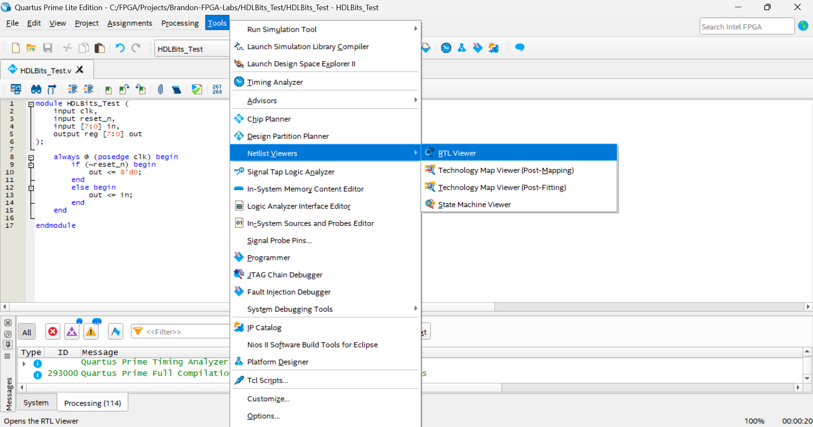
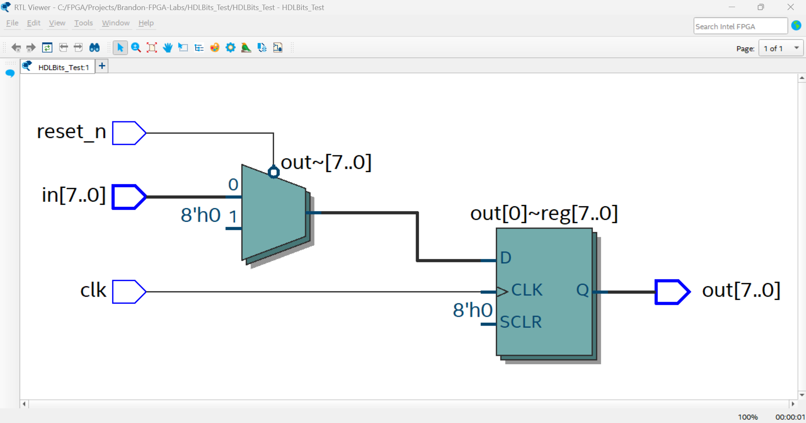
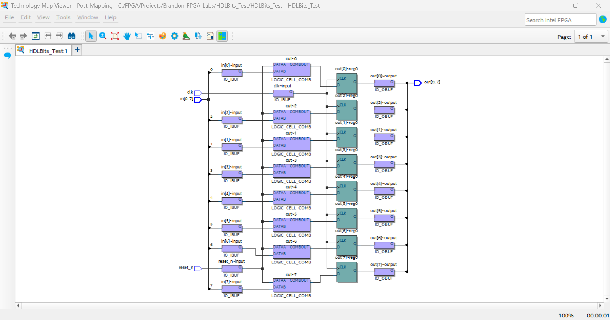
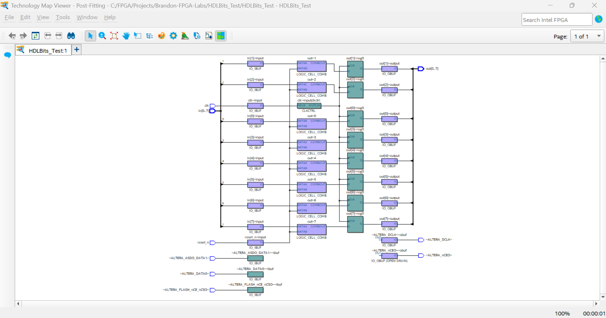

## 📌 Introduction
當我們撰寫完RTL code，想可視化以及確認綜合(Synthesis)是否符合預期。有許多工具可以使用，這邊筆記使用Quartus Prime中的RTL Viewer以及Technology Map Viewer。

- **RTL Viewer** – 根據HDL code 描述的邏輯畫出Block Diagram.  
- **Technology Map Viewer** – Technology Map是已經根據選擇的Device所有的資源進行綜合，過程中產生的門級網表的可視化圖。 選擇Tool時會看到有Post Mapping / Post Fitting. Post Mapping 中已經轉換成FPGA邏輯單元，但還沒佈局布線。 Post Fitting則是已經完成佈局布線。

## 🔷 RTL View

## 🟩 Technology Map Viewer  

## 📚 Reference
* [Intel Quartus Prime – RTL Viewer Documentation  ](https://www.intel.com/content/www/us/en/docs/programmable/683230/18-1/rtl-viewer-overview.html)
* [Intel Quartus Prime – Technology Map Viewer ](https://www.intel.com/content/www/us/en/docs/programmable/683641/21-3/technology-map-viewer-overview.html) 
