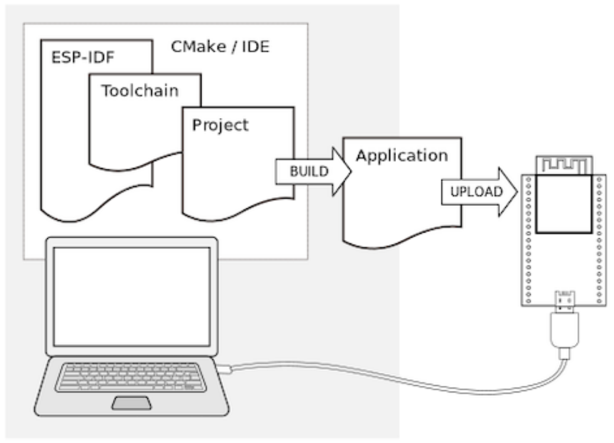
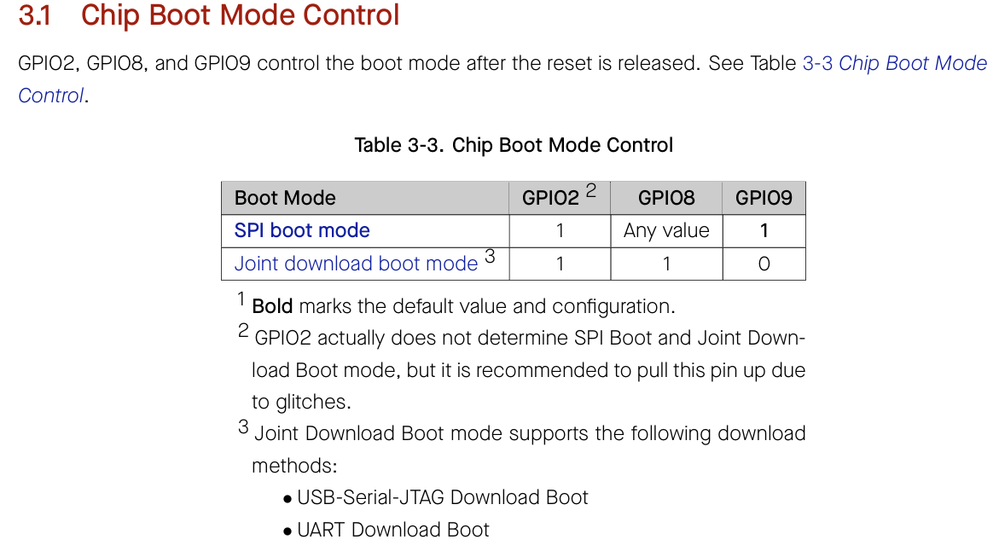

## 📌 開發環境簡介

### 硬體

* 開發板: ESP32-C3-SuperMini [Datasheet Link](../assets/day51/ESP32-C3%20SuperMini%20datasheet.pdf)
* 配件: USB-TypeC 線 


### 軟體

* 開發環境之作業系統: Windows11
* Docker: 4.43.1
* 開發環境之IDE: Visual Studio Code 
* 開發環境之SDK: Esp-idf v5.5.1



> * **Toolchain** to compile code for ESP32 
> * **Build tools** - CMake and Ninja to build a full Application for ESP32 
> * **ESP-IDF** that essentially contains API (software libraries and source code) for ESP32 and scripts to operate the Toolchain


## 📌 第一步: 使用Docker安裝Esp-idf SDK

請先將以下安裝完畢:
```
Docker.desktop
Windows WSL - Ubuntu
Visual Studio Code 
usbipd-win
```

### 

打開Docker.desktop


### [建議] 建立新的 VS Code設定檔
使用VS Code的一大好處，使用不同的設定檔，可以隔離開不同環境，每個環境下我們可以安裝不同的模組。
版本更迭，我們也可建立新的設定檔，新舊間可快速切換。

### 安裝ESP-IDF 在 VS Code
也可以選擇下載安裝包，手動設定安裝。這邊遵循官方建議，選擇在VS Code下安裝。

[ESP-IDF - Extension for VS Code](https://github.com/espressif/vscode-esp-idf-extension/blob/master/README.md)

> 題外話，2025年STM也開始正式發布VS Code之套件的SDK

## 📌 第二步: 嘗試與電腦連線

### 不斷重連斷線問題
新的開發板拿到，不確定裡面有無燒錄程式，有機會遇到一插上線連接電腦，不斷連線與斷線。
這時可以同時按板子上的Boot與Reset按鈕，進入燒錄模式。
> 板子上的BOOT按鈕，按下時下拉GPIO9 Pin，否則預設Reset完進入SPI boot mode



> In **Joint Download Boot mode**, users can download binary files into flash using UART0 or USB interface. It is also possible to download binary files into SRAM and execute it from SRAM.
> 
> [esp32-c3_datasheet_en](../assets/day51/esp32-c3_datasheet_en.pdf)

## 🧑‍💻 Code Example

```verilog

```

## 📚 Reference
* [ESP-IDF v5.5.1 Documentation](https://docs.espressif.com/projects/esp-idf/en/v5.5.1/esp32/)
* [ESP-IDF v5.5.1 Release Note](https://github.com/espressif/esp-idf/releases/tag/v5.5.1)
* [ESP-IDF - Extension for VS Code](https://github.com/espressif/vscode-esp-idf-extension/blob/master/README.md)
* [ESP-IDF - Using Docker Container](https://docs.espressif.com/projects/vscode-esp-idf-extension/en/latest/additionalfeatures/docker-container.html)